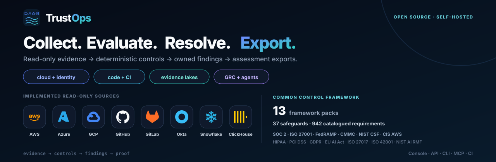
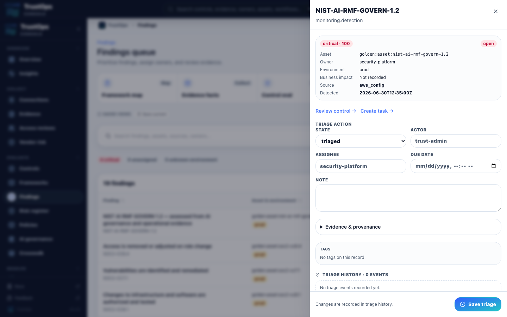

<p align="center">
  
</p>

<p align="center"><strong>Open, self-hosted GRC for cloud and AI.</strong></p>

<p align="center">
  <a href="https://pypi.org/project/trustops-security-data-lake/"></a>
  <a href="https://pypi.org/project/trustops-security-data-lake/"></a>
  <a href="https://github.com/msaad00/trustops-security-data-lake/actions/workflows/ci.yml"></a>
  <a href="LICENSE"></a>
</p>

<p align="center">
  <a href="#quick-start">Quick start</a> ·
  <a href="#how-it-works">How it works</a> ·
  <a href="#frameworks-and-common-controls">Frameworks & CCF</a> ·
  <a href="#explore">Explore</a> ·
  <a href="#develop-and-verify">Develop & verify</a>
</p>

TrustOps collects security evidence, evaluates controls, tracks follow-up work,
and exports assessments for review. **Built for humans and agents:** use the
console for investigation and review, or API, CLI, MCP, and CI for automation.
Deploy it in your environment. Data access and egress depend on your configured
connectors, sinks, and model integrations.

## Quick start

**Try the console with fixture data.** From a cloned repository, use Python 3.11+,
[uv](https://docs.astral.sh/uv/), and Node 22+:

```bash
uv sync --frozen --extra dev --extra server
make demo-local
```

Open [localhost:8787/console/dashboard/](http://127.0.0.1:8787/console/dashboard/).
The command builds the console, loads the golden fixture, migrates the local
database, and starts the server. This local demo disables authentication; use
[authenticated deployment](deploy/README.md) for a shared environment.

<details>
<summary><strong>Other setup paths</strong> — pip, CLI-only, and deployment</summary>

For a source install without uv:

```bash
python -m venv .venv
source .venv/bin/activate
pip install -e ".[dev,server]"
make web-install web-build
security-lakehouse fixtures load --company golden --out build/lakehouse
security-lakehouse db upgrade --lake build/lakehouse
security-lakehouse serve --lake build/lakehouse --server --allow-insecure-no-auth --port 8787
```

For the CLI and local lake only:

```bash
pip install trustops-security-data-lake
security-lakehouse fixtures load --company golden --out ./lake
```

[Docker, Helm, and production configuration](deploy/README.md) ·
[Server authentication](docs/SERVER_AUTH.md)

</details>

## How it works

| Step         | What you do                                          | What you get                                        |
| ------------ | ---------------------------------------------------- | --------------------------------------------------- |
| **Collect**  | Connect a source with read-only access.              | Evidence with source, freshness, and provenance.    |
| **Evaluate** | Apply deterministic control rules.                   | Results tied to evidence and the evaluated catalog. |
| **Resolve**  | Assign findings, track fixes, and review exceptions. | Ownership and a record of follow-up decisions.      |
| **Export**   | Freeze an assessment and share reports.              | Evidence and assessment history for reviewers.      |

The [Common Control Framework](docs/COMMON_CONTROL_FRAMEWORK.md) reuses safeguards
across framework mappings. A mapping does not itself establish compliance.
Models may summarize or propose actions; deterministic rules decide control results.

## Frameworks and common controls

<!-- BEGIN README CCF SUMMARY -->

**13 framework packs · 44 reusable safeguards · 15 control families · 942 catalogued requirements.**

559 requirements have safeguard mappings; **254 have reviewed mappings**. Catalog coverage and evaluated customer posture are separate measures.
<!-- END README CCF SUMMARY -->

<table>
<tr>
<td align="center"><br><strong>SOC 2</strong></td>
<td align="center"><br><strong>ISO 27001 · 27017 · 42001</strong></td>
<td align="center"><br><strong>NIST CSF 2.0</strong></td>
<td align="center"><br><strong>NIST AI RMF</strong></td>
</tr>
<tr>
<td align="center"><br><strong>CIS AWS</strong></td>
<td align="center"><br><strong>CMMC 2.0</strong></td>
<td align="center"><br><strong>EU AI Act · GDPR</strong></td>
<td align="center"><strong>FedRAMP Moderate<br>HIPAA · PCI DSS</strong></td>
</tr>
</table>

Framework identities show catalog scope. A pack may be a limited mapping;
see the [coverage matrix](docs/FRAMEWORK_COVERAGE.md) for the exact boundary.
**SOC 1 and ISO 27701 are planned**, with no catalogued controls yet.

| CCF layer              | What it represents                                                                                           |
| ---------------------- | ------------------------------------------------------------------------------------------------------------ |
| **Control families**   | Risk domains that organize reusable safeguards.                                                              |
| **Safeguards**         | Evidence requirements, ownership, review frequency, and executable evaluation rules.                         |
| **Framework mappings** | Links from safeguards to individual framework requirements, with proposed and reviewed status kept separate. |
| **Assessment results** | Pass, fail, stale, or not-evaluated outcomes from the collected evidence.                                    |

<details>
<summary><strong>Control families and evaluation details</strong></summary>

Identity & access · data protection · detection · logging · change management ·
availability · incident response · third-party risk · vulnerability management ·
AI governance · risk management · privacy · governance · monitoring · control operations.

One safeguard can serve several frameworks. Every required mapped safeguard must
pass for a requirement to pass; an unmapped requirement remains unmapped.
A reviewed mapping is not certification or proof that a customer's controls pass.

[CCF design and safeguards](docs/COMMON_CONTROL_FRAMEWORK.md) ·
[Coverage by framework](docs/FRAMEWORK_COVERAGE.md) ·
[Executable catalog](controls/catalog.json)

```bash
security-lakehouse frameworks safeguards --format table
```

</details>

## Explore

<details open>
<summary><strong>01 · Product tour</strong> — overview, evidence, and audit room</summary>

The images below show the stored demo fixture, not live customer evidence.

|                               Overview                                |                             Evidence                              |
| :-------------------------------------------------------------------: | :---------------------------------------------------------------: |
|     |  |
|                              Frameworks                               |                              Triage                               |
|  |      |

[Full walkthrough](docs/PRODUCT_WALKTHROUGH.md) ·
[Connectors](docs/images/trustops-demo-connectors.png) ·
[Findings](docs/images/trustops-demo-findings.png) ·
[Remediation](docs/images/trustops-demo-remediation.png) ·
[Audit room](docs/images/trustops-demo-audit-room.png) ·
[Workflows](docs/images/trustops-demo-workflows.png)

</details>

<details>
<summary><strong>02 · Connect sources</strong> — cloud, identity, code, and existing lakes</summary>

In the console, open **Connectors → choose a source → Discover → Test → Enable → Sync**.
No pre-existing data lake is required. For automation, use the
[headless setup playbook](docs/playbooks/HEADLESS_CONNECTOR_SETUP.md).

Sources include AWS, Azure, GCP, GitHub, GitLab, Okta, Snowflake, and ClickHouse.
Check the [connector catalog](docs/CONNECTORS.md) for each integration's scope and status.

No connector requires pasted long-lived cloud keys.

- **AWS** uses STS AssumeRole, one External ID per deployed role, short-lived session credentials, and read-only IAM posture APIs. Temporary credentials expire after each session; TrustOps stores no long-lived access keys. Scale rollout with CloudFormation StackSets or Terraform workspaces; Bulk account import is the next operator surface. See the [cloud setup guide](docs/LIVE_CLOUD_POC.md).
- **Azure** supports a customer-owned Entra application, managed identity, or federated workload identity with Reader scope.
- **Snowflake** uses a read-only service identity with a key-pair or OAuth token reference. TrustOps stores identifiers, not passwords or private-key contents. Snowflake is the existing security-data-lake path.

[AWS credential lifecycle diagram](docs/images/trustops-aws-sts-lifecycle.svg) ·
[Continuous ingestion](docs/CONTINUOUS_INGESTION.md)

</details>

<details>
<summary><strong>03 · Controls and workflows</strong> — safeguards, frameworks, and ownership</summary>

| Area                                                 | Read more                                                                                       |
| ---------------------------------------------------- | ----------------------------------------------------------------------------------------------- |
| Safeguards and executable rules                      | [Common Control Framework](docs/COMMON_CONTROL_FRAMEWORK.md)                                    |
| Framework mappings and coverage                      | [Framework coverage](docs/FRAMEWORK_COVERAGE.md)                                                |
| Findings, reviews, exceptions, and audit preparation | [Product walkthrough](docs/PRODUCT_WALKTHROUGH.md) · [Audit readiness](docs/AUDIT_READINESS.md) |
| Implemented, partial, and planned capabilities       | [Product status](docs/PRODUCT_SHAPE.md) · [Roadmap](ROADMAP.md)                                 |

Catalog size, mapped coverage, and evaluated results are separate measures. Inspect
the current safeguard catalog with `security-lakehouse frameworks safeguards`.

</details>

<details>
<summary><strong>04 · Deployment and interoperability</strong> — local, cloud, and evidence storage</summary>

```text
Source → Raw evidence → Normalized facts → Control evaluation → Assessment
                                                ↓                  ↓
                                           Owned findings    Review / export
```

| Layer                   | Current boundary                                                                                                |
| ----------------------- | --------------------------------------------------------------------------------------------------------------- |
| Evidence and evaluation | Local JSONL, deterministic rules, and verified assessment generations.                                          |
| Local analytics         | SQLite mart; DuckDB is optional.                                                                                |
| Operational state       | Application database and local state for jobs, assignments, and reviews.                                        |
| External storage        | Snowflake and ClickHouse integrations; verify the configured deployment.                                        |
| Portable evidence       | Optional [Parquet export](docs/PARQUET_EXPORT.md) of one verified generation; independently tested with DuckDB. |
| Open table catalogs     | Optional [Iceberg REST publication](docs/ICEBERG_REST.md); local Polaris and DuckDB snapshot reads tested.      |

Run locally with Python or Docker, or deploy the Helm chart in your own cloud.
The current assessment writer needs durable local POSIX storage and one writer
per lake. Snowflake and ClickHouse integrations are evidence backends; they do
not host the TrustOps application. Snowflake Native App packaging and Databricks
support are planned. See the [deployment guide](deploy/README.md).

[Architecture guide](docs/ARCHITECTURE.md) ·
[Architecture diagram](docs/images/trustops-assessment-architecture.svg) ·
[Assessment publication and failure contracts](docs/ASSESSMENT_GENERATIONS.md)

</details>

<details>
<summary><strong>05 · API, agents, and CI</strong> — use the same assessment engine headlessly</summary>

| Surface                                 | Purpose                                                          |
| --------------------------------------- | ---------------------------------------------------------------- |
| Console                                 | Browse posture, evidence, findings, and reviews.                 |
| [API](docs/api/AGENT_API.md)            | Versioned `/api/v1` access for integrations.                     |
| CLI                                     | Collect, evaluate, verify, export, and run the local server.     |
| [MCP](docs/HEADLESS_GRC.md)             | Read assessments and propose actions through governed tools.     |
| [CI](docs/playbooks/CI_POSTURE_GATE.md) | Apply posture and control-test thresholds to delivery workflows. |
| [OSCAL export](docs/OSCAL_EXPORT.md)    | NIST OSCAL component-definition and assessment-results JSON.     |

[TrustOps operator skill](agent-skills/trustops-operator/SKILL.md) ·
[Specialist skills](agent-skills/FRAMEWORK_SKILLS.md) ·
[Agent workflow catalog](docs/api/AGENT_SKILLS.md) ·
[AI bill of materials](docs/AIBOM.md)

</details>

## Develop and verify

<details>
<summary><strong>Checks, repository layout, and documentation</strong></summary>

```bash
make smoke       # backend, contracts, docs, brand, pipeline, API
make web-ci      # install, typecheck, production build
make security    # dependency audits and pre-commit checks
```

Regenerate fixture screenshots with `make demo-screenshots-full`.

| Directory                               | Contents                                           |
| --------------------------------------- | -------------------------------------------------- |
| `src/security_lakehouse/`               | Assessment engine, API, auth, connectors, and MCP. |
| `app/web/`                              | Next.js console.                                   |
| `controls/`, `frameworks/`, `mappings/` | Rules, framework catalogs, and mappings.           |
| `deploy/`                               | Deployment and infrastructure examples.            |
| `docs/`                                 | Product, architecture, operations, and API guides. |

[Validation and benchmark plan](docs/BENCHMARKS.md) ·
[Deployment](docs/DEPLOYMENT.md) · [Roadmap](ROADMAP.md) ·
[Third-party assets](docs/THIRD_PARTY_ASSETS.md)

</details>

[Apache-2.0 license](LICENSE).
