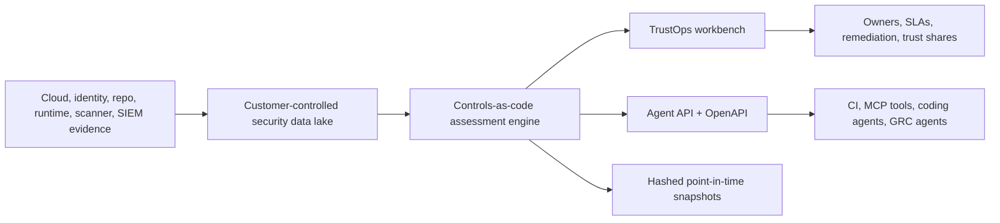
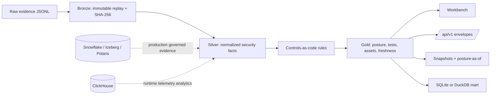

# TrustOps

Self-hosted trust operations for AI-era security teams.

TrustOps turns security evidence into live compliance posture, remediation
workflows, audit snapshots, repository governance graphs, and agent-readable APIs
while keeping evidence inside the customer's cloud, data lake, or local boundary.

<p align="center">
  
</p>

<p align="center">
  <a href="docs/PRODUCT_WALKTHROUGH.md"><strong>Product walkthrough</strong></a>
  ·
  <a href="docs/FRAMEWORK_COVERAGE.md"><strong>Framework coverage</strong></a>
  ·
  <a href="docs/CONNECTORS.md"><strong>Connectors</strong></a>
  ·
  <a href="docs/SERVER_AUTH.md"><strong>Server auth</strong></a>
  ·
  <a href="docs/api/AGENT_API.md"><strong>Agent API</strong></a>
</p>

<p align="center">
  
</p>

<p align="center">
  
  
</p>

## Why It Exists

Security and compliance teams need current posture, not stale spreadsheets.
TrustOps is built for companies that want to evaluate evidence where it already
lives, operate the control plane themselves, and expose the same facts to humans,
auditors, CI, and agents.



The default demo is intentionally small and self-contained. The production shape
is self-hosted server mode with API keys, OIDC/SAML, RBAC, tenant-scoped lake
paths, request audit events, scheduled connector syncs, and customer-owned
evidence storage.

## Shipped Surfaces

| Surface             | What is live in the repo                                                                                                                                                                                 |
| ------------------- | -------------------------------------------------------------------------------------------------------------------------------------------------------------------------------------------------------- |
| Trust workbench     | Next.js console with Trust Home, controls, evidence, violations, remediation, risk register, workflows, graph, insights, connectors, frameworks, crosswalk, audit log, trust center, and agent API views |
| Server mode         | FastAPI behind `.[server]`, API keys, OIDC, SAML, RBAC, request audit events, tenant/user spine, tenant-scoped lake resolution, and protected `/api/v1/*` plus `/api/*`                                  |
| Evidence pipeline   | Bronze raw replay records, silver normalized facts, gold posture/tests/assets/freshness, snapshots, SQLite local mart, optional DuckDB analytics                                                         |
| Continuous inputs   | 15 connector contracts; executable GitHub, AWS, Okta, Google Workspace, GCP, Azure, and Jira runners; scheduled syncs; repo audit/governance sync                                                        |
| Policy logic        | Controls-as-code rule engine with lintable rules, rule reasons, stale-evidence handling, and posture output annotations                                                                                  |
| Remediation         | Owner tasks, evidence requests, SLA dates, exceptions, risk register, and workflow actions                                                                                                               |
| Workflow automation | Workflow canvas plus dry-run preview, expression routing, snapshot, assignment, trust-share, webhook, Slack, and Jira actions on a guarded egress path                                                   |
| Agent/headless      | Versioned `/api/v1/*` envelopes, OpenAPI export, Python async SDK, MCP read/write tools, and the same auth/RBAC boundary as the UI                                                                       |

## Run The Demo

```bash
python -m venv .venv
source .venv/bin/activate
pip install -e ".[dev,server]"

security-lakehouse fixtures load --company fintech --out build/lakehouse
security-lakehouse db upgrade --lake build/lakehouse
security-lakehouse serve \
  --lake build/lakehouse \
  --server \
  --allow-insecure-no-auth \
  --port 8787
```

Open:

```text
http://127.0.0.1:8787/console/dashboard/
```

The fixture data is synthetic and intentionally contains failing controls so the
workbench shows remediation queues, stale/freshness signals, evidence links, and
snapshot actions. It is separate from production use. Production deployments
read from customer-controlled evidence stores and connector runners.

Quick API probes:

```bash
curl -s http://127.0.0.1:8787/api/v1/posture/current | jq .
curl -s 'http://127.0.0.1:8787/api/v1/control-tests?result=fail&limit=10' | jq .
security-lakehouse openapi --out build/openapi.json
```

## Evidence Flow



TrustOps can start with managed local evidence, but the preferred production
path is read-only access to an existing security data lake or customer-owned
object store. Direct source tokens are used only when the source system is the
authority for that evidence.

See [Connector And Access Model](docs/CONNECTORS.md).

## Product Screens

<p align="center">
  
  
</p>

| View            | What it proves                                                                                   |
| --------------- | ------------------------------------------------------------------------------------------------ |
| Trust Home      | Current posture, confidence, freshness, failing controls, remediation queue, and live API status |
| Workflow canvas | Reusable remediation and evidence workflows with guarded outbound actions                        |
| Frameworks      | Source-linked framework scope, readiness gates, coverage, and provenance                         |
| Connectors      | Read-only-first integration strategy, connector state, and sync boundaries                       |
| Trust center    | Expiring reviewer shares with token hashing and auditor redaction                                |

## Framework Coverage

TrustOps currently ships **34 source-linked controls** across **8 framework
families**, with reviewed mappings for every seeded control.

| Framework family    | Seeded controls | Reviewed mappings |
| ------------------- | --------------: | ----------------: |
| NIST AI RMF         |               6 |                 6 |
| HIPAA Security Rule |               6 |                 6 |
| GDPR                |               6 |                 6 |
| EU AI Act           |               6 |                 6 |
| ISO/IEC 27001       |               3 |                 3 |
| PCI DSS             |               3 |                 3 |
| SOC 2 TSC           |               2 |                 2 |
| ISO/IEC 42001       |               2 |                 2 |

Coverage details, source URLs, readiness gates, and roadmap percentages live in
the [Framework Coverage Matrix](docs/FRAMEWORK_COVERAGE.md).

Framework names are rendered as neutral text labels in product and docs. TrustOps
does **not** ship made-up logos, lookalike seals, regulator marks, or
certification badges. Official third-party logos are added only when usage terms,
attribution, owner, and review date are recorded in the
[Third-Party Asset Policy](docs/THIRD_PARTY_ASSETS.md).

## Human And Agent API

`/api/v1/*` is the stable headless contract for agents and external clients. It
returns `{data, meta, errors}` envelopes and supports filtering and pagination on
list resources.

| Route                                     | Purpose                                         |
| ----------------------------------------- | ----------------------------------------------- |
| `GET /api/v1/healthz`                     | service status                                  |
| `GET /api/v1/posture/current`             | current posture, scores, confidence, violations |
| `GET /api/v1/control-tests`               | control tests, owners, confidence, next action  |
| `GET /api/v1/violations`                  | open control and asset violations               |
| `GET /api/v1/evidence`                    | normalized evidence facts                       |
| `GET /api/v1/assets`                      | asset risk queue                                |
| `GET /api/v1/insights/timeseries`         | captured posture and trend points               |
| `GET /api/v1/public/trust-shares/{token}` | auditor-scoped public posture                   |
| `POST /api/v1/snapshots`                  | point-in-time assessment snapshot               |

Server mode requires auth for non-health routes. API keys, OIDC, and SAML all
resolve to the same tenant, user, role, and audit boundary. See
[Server Auth](docs/SERVER_AUTH.md) and [Agent API](docs/api/AGENT_API.md).

## Core Commands

```bash
security-lakehouse validate --raw data/raw/security_events.jsonl
security-lakehouse pipeline run --raw data/raw/security_events.jsonl --out build/lakehouse
security-lakehouse assessment status --lake build/lakehouse
security-lakehouse assessment tests --lake build/lakehouse
security-lakehouse assessment violations --lake build/lakehouse
security-lakehouse assessment snapshot --lake build/lakehouse --reason vendor_due_diligence
curl -s 'http://127.0.0.1:8787/api/v1/posture/as-of?as_of=2026-05-20T17:00:00Z' | jq .
security-lakehouse query --lake build/lakehouse "select * from control_posture order by risk_score desc"
security-lakehouse repo audit https://github.com/OWNER/REPO --out build/repo-audit.jsonl
GITHUB_TOKEN=... security-lakehouse repo governance-sync OWNER/REPO --out build/repo-governance.jsonl
```

Connector examples:

```bash
security-lakehouse connectors validate
security-lakehouse connectors list
security-lakehouse connectors configure \
  --lake build/lakehouse \
  --connector-id github-security \
  --state enabled
security-lakehouse connectors sync \
  --lake build/lakehouse \
  --connector-id github-security \
  --repo OWNER/REPO \
  --fixture-dir tests/fixtures/github-governance
```

Executable connector runners currently cover `github-security`,
`aws-posture`, `okta-identity`, `google-workspace-identity`, `gcp-posture`,
`azure-posture`, and `jira-ticketing`. Snowflake, ClickHouse, object storage,
SIEM, and runtime-gateway entries are read-only lake contracts unless a direct
runner is added.

Workflow examples:

```bash
security-lakehouse workflow list --lake build/lakehouse
security-lakehouse workflow run --lake build/lakehouse --id <workflow_id>
```

## Data Model

```text
raw evidence
  -> bronze/raw_events.jsonl          immutable replay + SHA-256
  -> silver/normalized_events.jsonl   canonical security facts
  -> gold/control_posture.jsonl       framework and control posture
  -> gold/control_tests.jsonl         program tests, owners, SLAs, confidence
  -> gold/remediation_tasks.jsonl     owner tasks, evidence requests, exceptions
  -> gold/asset_risk.jsonl            owner remediation queue
  -> gold/current_posture.json        live posture contract
  -> gold/snapshots/*.json            point-in-time assessment evidence
  -> mart/security_lakehouse.sqlite   local SQL smoke/demo surface
  -> mart/security_data_lake.duckdb   optional local analytical mart
```

## Storage Strategy

TrustOps separates product logic from storage.

| Store                         | Role                                                                          | Status                      |
| ----------------------------- | ----------------------------------------------------------------------------- | --------------------------- |
| Snowflake / Iceberg / Polaris | governed customer evidence, audit views, retention, RBAC, executive reporting | target production path      |
| ClickHouse                    | high-volume runtime telemetry, prompt/tool events, trend analytics            | target hot telemetry path   |
| DuckDB                        | local analytical file for larger local datasets                               | optional via `.[analytics]` |
| SQLite                        | zero-dependency local mart and app-state demo database                        | default local path          |

SQLite is not the strategic data lake. It is the smallest local artifact that
makes the product runnable without cloud credentials. Production deployments use
customer-controlled storage and server-mode auth boundaries.

## Verification

```bash
make smoke
PYTHONPATH=src pytest -q
npm --prefix app/web run typecheck
npm --prefix app/web run build
```

The smoke target validates raw evidence, runs the pipeline, renders the console,
and executes the regression suite.

## Repo Map

```text
src/security_lakehouse/     CLI, pipeline, assessment engine, API, auth, server mode
app/web/                    Next.js workbench
data/                       sample evidence and JSON schemas
connectors/                 source connector and access-boundary catalog
controls/                   implemented control catalog and policy rules
programs/                   compliance program and control-test catalog
frameworks/                 source-linked framework registry
deploy/                     Snowflake, ClickHouse, Docker, Helm, EKS assets
docs/                       architecture, product walkthrough, coverage, API docs
agent-skills/               guardrailed analyst skills for humans and agents
tests/                      pipeline, API, auth, policy, connector, UI contract tests
```
