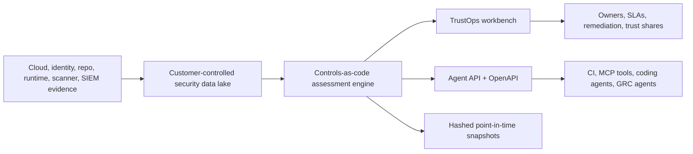
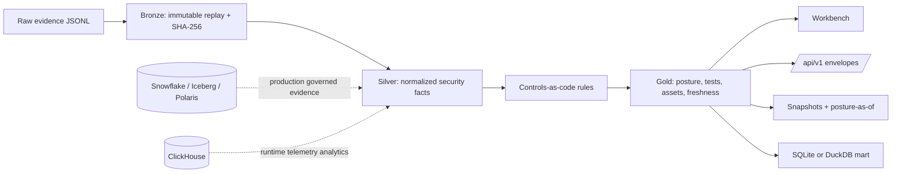
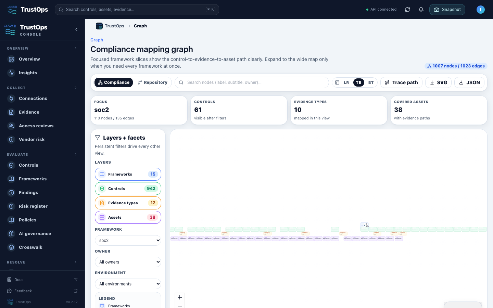
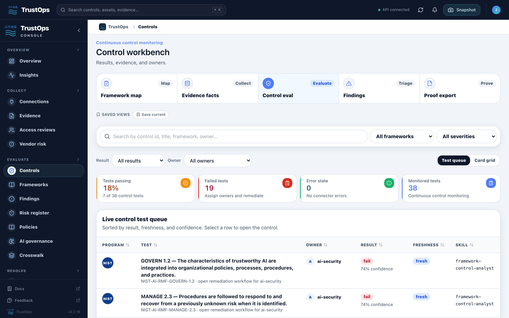

# TrustOps

Open-source AI and cloud security trust control plane.

TrustOps turns cloud, identity, repository, runtime, and AI security evidence
into continuous posture evaluation, compliance mapping, tagged findings,
remediation workflows, audit snapshots, graph lineage, and agent-readable APIs
while keeping evidence inside the customer's cloud, data lake, or local boundary.

<p align="center">
  
</p>

<p align="center">
  <a href="docs/PRODUCT_WALKTHROUGH.md"><strong>Product walkthrough</strong></a>
  ·
  <a href="docs/FRAMEWORK_COVERAGE.md"><strong>Framework coverage</strong></a>
  ·
  <a href="docs/CONNECTORS.md"><strong>Connectors</strong></a>
  ·
  <a href="docs/SERVER_AUTH.md"><strong>Server auth</strong></a>
  ·
  <a href="docs/api/AGENT_API.md"><strong>Agent API</strong></a>
</p>

<p align="center">
  
</p>

<p align="center">
  <strong>Trust Command Center</strong> for current posture · <strong>Control Workbench</strong> for evidence-backed tests ·
  <strong>DAG Workflow Canvas</strong> for closed-loop remediation · <strong>Graph</strong> for framework-to-asset mapping ·
  <strong>Headless API</strong> for agents and CI
</p>

## Why It Exists

Security, compliance, platform, and AI teams need current posture, not stale
spreadsheets. TrustOps is built for companies that want to evaluate evidence
where it already lives, operate the trust control plane themselves, continuously
monitor violations and freshness, tag findings to controls and owners, and
expose the same facts to humans, auditors, CI, and agents.



The default demo is intentionally small and self-contained. Production mode is
self-hosted with API keys, OIDC/SAML, RBAC, tenant-scoped lake paths, request
audit events, scheduled connector syncs, and customer-owned evidence storage.

## What Ships

- **Trust workbench** — Trust Command Center, controls, evidence, violations,
  remediation, risk register, workflows, graph, insights, connectors,
  frameworks, crosswalk, audit log, trust center, and agent API views.
- **Server mode** — FastAPI behind `.[server]`, API keys, OIDC, SAML, RBAC,
  request audit events, tenant/user spine, and protected `/api/v1/*` plus
  `/api/*`.
- **Evidence pipeline** — bronze raw replay records, silver normalized facts,
  gold posture/tests/assets/freshness, snapshots, SQLite local mart, and
  optional DuckDB analytics.
- **Continuous inputs** — 15 connector contracts; executable GitHub, AWS,
  Okta, Google Workspace, GCP, Azure, and Jira runners; scheduled syncs; repo
  audit/governance sync.
- **Automation and agents** — controls-as-code rules, tags, remediation tasks,
  evidence requests, DAG workflows, guarded actions, OpenAPI, Python SDK, and
  MCP read/write tools.

## Run The Demo

```bash
python -m venv .venv
source .venv/bin/activate
pip install -e ".[dev,server]"

security-lakehouse fixtures load --company fintech --out build/lakehouse
security-lakehouse db upgrade --lake build/lakehouse
security-lakehouse serve \
  --lake build/lakehouse \
  --server \
  --allow-insecure-no-auth \
  --port 8787
```

Open:

```text
http://127.0.0.1:8787/console/dashboard/
```

The fixture data is synthetic and intentionally contains failing controls so the
workbench shows remediation queues, stale/freshness signals, evidence links, and
snapshot actions. It is separate from production use. Production deployments
read from customer-controlled evidence stores and connector runners.

Quick API probes:

```bash
curl -s http://127.0.0.1:8787/api/v1/posture/current | jq .
curl -s 'http://127.0.0.1:8787/api/v1/control-tests?result=fail&limit=10' | jq .
security-lakehouse openapi --out build/openapi.json
```

## Evidence Flow



TrustOps can start with managed local evidence, but the preferred production
path is read-only access to an existing security data lake or customer-owned
object store. Direct source tokens are used only when the source system is the
authority for that evidence.

### Snowflake Evidence Lake

Snowflake is the governed evidence path: TrustOps reads customer-owned evidence
views with a least-privilege role, materializes bronze/silver/gold posture, and
serves the same current state to the console, snapshots, and agent APIs.

<p align="center">
  
</p>

The live Snowflake runner is intentionally read-only. It expects TrustOps-shaped
views such as `TRUSTOPS_AUDIT_EVENTS`, `TRUSTOPS_CONTROL_POSTURE`,
`TRUSTOPS_ASSET_RISK`, and `TRUSTOPS_EVIDENCE_BUNDLES`, then rebuilds the
local lake and current posture from the collected evidence.

See [Connector And Access Model](docs/CONNECTORS.md).

## Product Screens

<p align="center">
  
  
</p>

<p align="center">
  
  
</p>

<p align="center">
  
  
</p>

**What the walkthrough proves:** current posture and freshness, click-through
control evidence, violation triage, remediation SLAs, guarded workflow actions,
source connector sync boundaries, graph path tracing, expiring trust shares, and
agent-readable API contracts.

## Framework Coverage

TrustOps currently ships **34 source-linked controls** across **8 framework
families**, with reviewed mappings for every seeded control. Coverage details,
source URLs, readiness gates, and roadmap percentages live in the
[Framework Coverage Matrix](docs/FRAMEWORK_COVERAGE.md).

Framework names are rendered as neutral text labels in product and docs. TrustOps
does **not** ship made-up logos, lookalike seals, regulator marks, or
certification badges. Official third-party logos are added only when usage terms,
attribution, owner, and review date are recorded in the
[Third-Party Asset Policy](docs/THIRD_PARTY_ASSETS.md).

## Human And Agent API

`/api/v1/*` is the stable headless contract for agents and external clients.
Routes return `{data, meta, errors}` envelopes with filtering and pagination on
list resources. The main resources are posture, control tests, violations,
evidence, assets, insight time series, trust shares, and snapshots.

Server mode requires auth for non-health routes. API keys, OIDC, and SAML all
resolve to the same tenant, user, role, and audit boundary. See
[Server Auth](docs/SERVER_AUTH.md) and [Agent API](docs/api/AGENT_API.md).

## Useful Commands

```bash
security-lakehouse validate --raw data/raw/security_events.jsonl
security-lakehouse pipeline run --raw data/raw/security_events.jsonl --out build/lakehouse
security-lakehouse assessment status --lake build/lakehouse
security-lakehouse assessment tests --lake build/lakehouse
security-lakehouse assessment violations --lake build/lakehouse
security-lakehouse assessment snapshot --lake build/lakehouse --reason vendor_due_diligence
curl -s 'http://127.0.0.1:8787/api/v1/posture/as-of?as_of=2026-05-20T17:00:00Z' | jq .
security-lakehouse query --lake build/lakehouse "select * from control_posture order by risk_score desc"
security-lakehouse repo audit https://github.com/OWNER/REPO --out build/repo-audit.jsonl
GITHUB_TOKEN=... security-lakehouse repo governance-sync OWNER/REPO --out build/repo-governance.jsonl
```

Connector examples:

```bash
security-lakehouse connectors validate
security-lakehouse connectors list
security-lakehouse connectors configure \
  --lake build/lakehouse \
  --connector-id github-security \
  --state enabled
security-lakehouse connectors sync \
  --lake build/lakehouse \
  --connector-id github-security \
  --repo OWNER/REPO \
  --fixture-dir tests/fixtures/github-governance
```

Executable connector runners currently cover `github-security`,
`aws-posture`, `okta-identity`, `google-workspace-identity`, `gcp-posture`,
`azure-posture`, and `jira-ticketing`. Snowflake, ClickHouse, object storage,
SIEM, and runtime-gateway entries are read-only lake contracts unless a direct
runner is added.

Workflow examples:

```bash
security-lakehouse workflow list --lake build/lakehouse
security-lakehouse workflow run --lake build/lakehouse --id <workflow_id>
```

## Data Model

Raw evidence flows through bronze replay records, silver normalized security
facts, gold posture/control/remediation outputs, point-in-time snapshots, and a
local mart. SQLite is the default local artifact; Snowflake/Iceberg/Polaris and
ClickHouse are the production evidence and telemetry paths. See
[Data Model](docs/DATA_MODEL.md) and [Architecture](docs/ARCHITECTURE.md).

## Verification

```bash
make smoke
PYTHONPATH=src pytest -q
npm --prefix app/web run typecheck
npm --prefix app/web run build
```

The smoke target validates raw evidence, runs the pipeline, renders the console,
and executes the regression suite.

## Repo Map

```text
src/security_lakehouse/     CLI, pipeline, assessment engine, API, auth, server mode
app/web/                    Next.js workbench
data/                       sample evidence and JSON schemas
connectors/                 source connector and access-boundary catalog
controls/                   implemented control catalog and policy rules
programs/                   compliance program and control-test catalog
frameworks/                 source-linked framework registry
deploy/                     Snowflake, ClickHouse, Docker, Helm, EKS assets
docs/                       architecture, product walkthrough, coverage, API docs
agent-skills/               guardrailed analyst skills for humans and agents
tests/                      pipeline, API, auth, policy, connector, UI contract tests
```
