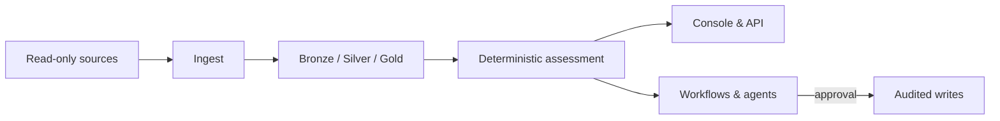

# TrustOps Security Data Lake

<p align="center">
  
</p>

**Open-source trust operations** — turn cloud, identity, code, runtime, and AI evidence into live posture, framework readiness, findings, workflows, snapshots, and shareable proof. Evidence stays in **your** lake, VPC, or laptop.

> **Naming:** **TrustOps** is the product. **TrustOps Console** is the web UI.
> The repo/package name `trustops-security-data-lake` and CLI `security-lakehouse`
> are operator surfaces — see [Brand guide](docs/BRAND.md).

<p align="center">
  
</p>

<p align="center">
  <a href="docs/PRODUCT_WALKTHROUGH.md"><strong>Walkthrough</strong></a> ·
  <a href="docs/SHAREABLE_DEMO.md"><strong>Demo</strong></a> ·
  <a href="docs/ARCHITECTURE.md"><strong>Architecture</strong></a> ·
  <a href="docs/CONNECTORS.md"><strong>Connectors</strong></a> ·
  <a href="docs/DEPLOYMENT_AND_PRICING.md"><strong>Deploy</strong></a> ·
  <a href="docs/diagrams/README.md"><strong>Diagrams</strong></a> ·
  <a href="CHANGELOG.md"><strong>Changelog</strong></a>
</p>

## At a glance

|                |                                                                                                    |
| -------------- | -------------------------------------------------------------------------------------------------- |
| **Release**    | `0.2.0` — OSS demos and self-hosted pilots ([readiness](docs/RELEASE_READINESS.md))                |
| **Catalog**    | 10 framework families · **635** controls · 18 asset types ([coverage](docs/FRAMEWORK_COVERAGE.md)) |
| **Deployment** | Local $0 · self-hosted Helm · managed hosted ([pricing](docs/DEPLOYMENT_AND_PRICING.md))           |
| **Surfaces**   | Console · `/api/v1` · SDK · MCP · optional agents ([API](docs/api/AGENT_API.md))                   |

One loop: **collect → evaluate → remediate → automate → share** — with deterministic control verdicts, approval-gated writes, and immutable snapshots.

## Console

<p align="center">
  
</p>

|                                                         Trust command center                                                         |                                                   Evidence room                                                    |
| :----------------------------------------------------------------------------------------------------------------------------------: | :----------------------------------------------------------------------------------------------------------------: |
|  |  |

|                                                        Automation                                                        |                                                  Trust center                                                  |
| :----------------------------------------------------------------------------------------------------------------------: | :------------------------------------------------------------------------------------------------------------: |
|  |  |

More screens: [connectors](docs/images/trustops-demo-connectors.png) · [frameworks](docs/images/trustops-demo-frameworks.png) · [graph](docs/images/trustops-demo-graph.png) · [controls](docs/images/trustops-demo-control-drawer.png) — see [Product Walkthrough](docs/PRODUCT_WALKTHROUGH.md).

## How it works

Connectors read evidence **read-only**. A bronze → silver → gold pipeline normalizes facts; controls-as-code produces posture, violations, and snapshots. The console, API, workflows, and agents sit on top — models may summarize or propose actions, but **never own the verdict**.

<p align="center">
  
</p>



| Layer       | Role                                                  |
| ----------- | ----------------------------------------------------- |
| **Ingest**  | Idempotent connector sync into customer-owned storage |
| **Assess**  | Pass / fail / stale / missing, hashes, snapshot chain |
| **Operate** | Dashboards, remediation, automation, trust shares     |
| **Agents**  | Optional MCP + harness; writes stay approval-gated    |

Details: [Architecture](docs/ARCHITECTURE.md) · [Continuous ingestion](docs/CONTINUOUS_INGESTION.md) · [Agent harness](docs/AGENT_HARNESS.md) · [Visual system](docs/VISUAL_SYSTEM.md)

## Quick start

```bash
python -m venv .venv && source .venv/bin/activate
pip install -e ".[dev,server]"

security-lakehouse fixtures load --company golden --out build/lakehouse
security-lakehouse db upgrade --lake build/lakehouse
security-lakehouse serve --lake build/lakehouse --server --allow-insecure-no-auth --port 8787
```

Open **http://127.0.0.1:8787/console/dashboard/** — the golden fixture ships 37 controls with intentional gaps so the workbench has real posture to triage.

```bash
curl -s http://127.0.0.1:8787/api/v1/posture/current | jq .
security-lakehouse pipeline run --raw data/raw/security_events.jsonl --out build/lakehouse
security-lakehouse assessment snapshot --lake build/lakehouse --reason demo
```

Regenerate README screenshots after UI changes: `make demo-screenshots` (server on `:8787`).

## Documentation

| Topic                    | Doc                                                                                                                                     |
| ------------------------ | --------------------------------------------------------------------------------------------------------------------------------------- |
| Product tour & UX        | [PRODUCT_WALKTHROUGH.md](docs/PRODUCT_WALKTHROUGH.md)                                                                                   |
| Framework packs          | [FRAMEWORK_PACKS.md](docs/FRAMEWORK_PACKS.md)                                                                                           |
| Connectors & access      | [CONNECTORS.md](docs/CONNECTORS.md)                                                                                                     |
| Auth & tenancy           | [SERVER_AUTH.md](docs/SERVER_AUTH.md)                                                                                                   |
| Shareable POC            | [SHAREABLE_DEMO.md](docs/SHAREABLE_DEMO.md) · [SHAREABLE_POC_HOSTING.md](docs/SHAREABLE_POC_HOSTING.md)                                 |
| MCP evidence + approvals | [cookbook/MCP_EVIDENCE_AND_APPROVALS.md](docs/cookbook/MCP_EVIDENCE_AND_APPROVALS.md)                                                   |
| Ops runbooks             | [BACKUP_RESTORE.md](docs/runbooks/BACKUP_RESTORE.md) · [OBSERVABILITY_CONNECTOR_SYNC.md](docs/runbooks/OBSERVABILITY_CONNECTOR_SYNC.md) |
| Snowflake / ClickHouse   | [HERO_DATA_LAKES.md](docs/HERO_DATA_LAKES.md)                                                                                           |
| 85% self-hosted bar      | [TRUSTOPS_85_PLAN.md](docs/TRUSTOPS_85_PLAN.md)                                                                                         |
| Roadmap                  | [ROADMAP.md](ROADMAP.md)                                                                                                                |

## Verify

```bash
make smoke          # validate, pipeline, dashboard, pytest
make demo-screenshots   # optional: refresh docs/images/trustops-demo-*.png
```

## Repo layout

```text
src/security_lakehouse/   pipeline, assessment, API, auth, MCP
app/web/                  Next.js console
controls/ frameworks/     catalogs and mappings
deploy/                   Helm, Docker, Snowflake, ClickHouse, EKS
docs/                     architecture, walkthrough, diagrams
```

Framework labels in the UI are **neutral text marks** — not official certification logos. See [THIRD_PARTY_ASSETS.md](docs/THIRD_PARTY_ASSETS.md).
