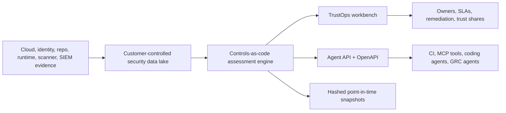
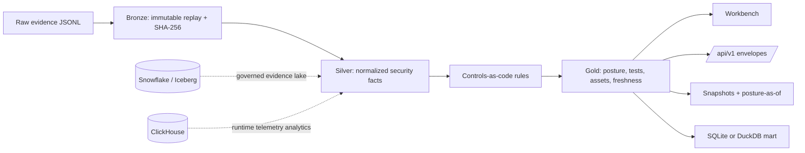
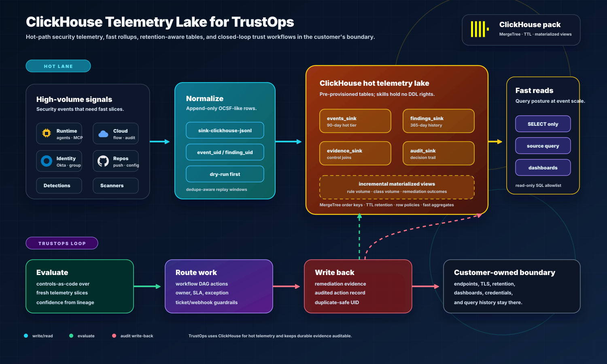

# TrustOps

Open-source AI and cloud security trust control plane.

TrustOps turns cloud, identity, repository, runtime, and AI security evidence
into continuous posture evaluation, compliance mapping, tagged findings,
remediation workflows, audit snapshots, graph lineage, and agent-readable APIs
while keeping evidence inside the customer's cloud, data lake, or local boundary.

<p align="center">
  
</p>

<p align="center">
  <a href="docs/PRODUCT_WALKTHROUGH.md"><strong>Product walkthrough</strong></a>
  ·
  <a href="docs/FRAMEWORK_COVERAGE.md"><strong>Framework coverage</strong></a>
  ·
  <a href="docs/CONNECTORS.md"><strong>Connectors</strong></a>
  ·
  <a href="docs/SERVER_AUTH.md"><strong>Server auth</strong></a>
  ·
  <a href="docs/api/AGENT_API.md"><strong>Agent API</strong></a>
</p>

<p align="center">
  
</p>

<p align="center">
  <strong>Trust Command Center</strong> for current posture · <strong>Control Workbench</strong> for evidence-backed tests ·
  <strong>DAG Workflow Canvas</strong> for closed-loop remediation · <strong>Graph</strong> for framework-to-asset mapping ·
  <strong>Headless API</strong> for agents and CI
</p>

## Why It Exists

Security, compliance, platform, and AI teams need current posture, not stale
spreadsheets. TrustOps is built for companies that want to evaluate evidence
where it already lives, operate the trust control plane themselves, continuously
monitor violations and freshness, tag findings to controls and owners, and
expose the same facts to humans, auditors, CI, and agents.



The default demo is intentionally small and self-contained. Production mode is
self-hosted with API keys, OIDC/SAML, RBAC, tenant-scoped lake paths, request
audit events, scheduled connector syncs, and customer-owned evidence storage.

## What Ships

TrustOps is organized around one operating loop instead of disconnected GRC
tabs: collect source evidence, evaluate controls, route risk, automate follow-up,
and share the right proof with the right audience.

| Surface                     | What it does                                                                                        | Primary users                          |
| --------------------------- | --------------------------------------------------------------------------------------------------- | -------------------------------------- |
| **Posture**                 | Live score, framework readiness, failing tests, stale controls, and open violations.                | Security, GRC, platform                |
| **Controls and frameworks** | Versioned controls-as-code, reviewed source mappings, provenance, and cross-framework overlap.      | GRC, auditors, control owners          |
| **Evidence**                | Normalized facts, freshness SLAs, source hashes, and replayable bronze/silver/gold lake artifacts.  | Security engineering, audit ops        |
| **Risk and remediation**    | Findings, severity, owners, due dates, task state, and remediation workflow history.                | Control owners, engineering managers   |
| **Automation**              | DAG workflows for evidence requests, triage, notifications, snapshots, and guarded actions.         | Security operations, platform          |
| **Trust center**            | Scoped internal, auditor, and customer views with expiring share tokens and data-boundary defaults. | Sales engineering, auditors, customers |
| **Headless agents**         | Stable `/api/v1/*` envelopes, OpenAPI, Python SDK, MCP tools, and optional LangGraph harness.       | CI, agents, internal tools             |

The UI mirrors these lanes: **Trust** for live posture and proof, **Workflows**
for remediation and automation, **Sources** for connectors/framework mappings,
and **Review** for graph, insights, audit, risk, and agent-facing APIs.

## Run The Demo

```bash
python -m venv .venv
source .venv/bin/activate
pip install -e ".[dev,server]"

security-lakehouse fixtures load --company fintech --out build/lakehouse
security-lakehouse db upgrade --lake build/lakehouse
security-lakehouse serve \
  --lake build/lakehouse \
  --server \
  --allow-insecure-no-auth \
  --port 8787
```

Open:

```text
http://127.0.0.1:8787/console/dashboard/
```

The fixture data is synthetic and intentionally contains failing controls so the
workbench shows remediation queues, stale/freshness signals, evidence links, and
snapshot actions. It is separate from production use. Production deployments
read from customer-controlled evidence stores and connector runners.

Quick API probes:

```bash
curl -s http://127.0.0.1:8787/api/v1/posture/current | jq .
curl -s 'http://127.0.0.1:8787/api/v1/control-tests?result=fail&limit=10' | jq .
security-lakehouse openapi --out build/openapi.json
```

## Evidence Flow



TrustOps can start with managed local evidence, but the preferred production
path is read-only access to an existing security data lake or customer-owned
object store. Direct source tokens are used only when the source system is the
authority for that evidence.

## Security Data Lake Backends

TrustOps is not a vendor-hosted evidence silo. It can evaluate posture from the
customer's lake, then write only the minimum assessment state needed for
dashboards, snapshots, workflows, and agent APIs.

| Backend        | Role in TrustOps                                                                                          | Current status                                          |
| -------------- | --------------------------------------------------------------------------------------------------------- | ------------------------------------------------------- |
| **Snowflake**  | governed evidence lake for audit, RBAC, retention, dynamic rollups, and optional Iceberg interoperability | executable read-only evidence runner + schema artifacts |
| **ClickHouse** | hot telemetry lake for runtime, detection, identity, repo, and scanner events with fast aggregates        | schema artifacts + telemetry contract                   |
| **Databricks** | lakehouse and AI-governance path for Delta/Unity-Catalog-style estates                                    | coming soon; not claimed as shipped                     |

### Snowflake Governed Evidence Lake

Use Snowflake when the primary question is evidence governance: auditability,
retention, least-privilege roles, row/masking policies, query history, and
warehouse-native posture rollups. TrustOps can read customer-owned evidence
views, ingest row streams or staged files into evidence tables, and keep
governed outputs available to the console, snapshots, trust shares, and agent
APIs.

<p align="center">
  
</p>

Use streaming row ingestion for high-frequency runtime, identity, and detection
events; staged-file ingestion for scanner exports, SARIF, evidence bundles, and
periodic audit packets; and read-only views when Snowflake is already the system
of record. The live runner remains read-only by default and does not require DDL
privileges.

### ClickHouse Telemetry Lake

Use ClickHouse when the primary question is operational speed: what changed in
the last few minutes, which runtime policies are firing, which assets are
getting worse, and which control families are creating the most remediation
load. TrustOps keeps the same normalized evidence model, but uses ClickHouse for
hot-path event windows, materialized rollups, retention policies, and dashboard
queries.

<p align="center">
  
</p>

See [Connector And Access Model](docs/CONNECTORS.md) and
[Hero Security Data Lakes](docs/HERO_DATA_LAKES.md).

## Framework Coverage

TrustOps currently ships **34 source-linked controls** across **8 framework
families**, with reviewed mappings for every seeded control. The catalog also
models **13 asset types** and **92 control-to-asset applicability links**, so
the graph, asset risk queue, and API can answer which controls apply to a repo,
identity, model, data store, host, or runtime asset. Coverage details, source
URLs, readiness gates, applicability, and roadmap percentages live in the
[Framework Coverage Matrix](docs/FRAMEWORK_COVERAGE.md).

Framework names are rendered as neutral text labels in product and docs. TrustOps
does **not** ship made-up logos, lookalike seals, regulator marks, or
certification badges. Official third-party logos are added only when usage terms,
attribution, owner, and review date are recorded in the
[Third-Party Asset Policy](docs/THIRD_PARTY_ASSETS.md).

## Human And Agent API

`/api/v1/*` is the stable headless contract for agents and external clients.
Routes return `{data, meta, errors}` envelopes with filtering and pagination on
list resources. The main resources are posture, control tests, violations,
evidence, assets, insight time series, trust shares, and snapshots.

<p align="center">
  
</p>

Server mode requires auth for non-health routes. API keys, OIDC, and SAML all
resolve to the same tenant, user, role, and audit boundary. See
[Server Auth](docs/SERVER_AUTH.md) and [Agent API](docs/api/AGENT_API.md).

### Optional Agent Harness

TrustOps does not require an LLM for connectors, evidence normalization,
controls-as-code evaluation, framework mapping, scoring, snapshots, trust
shares, or audit logs. Those stay deterministic and testable.

The optional harness in `security_lakehouse.agents` can run in `rules_only`
mode or compile a LangGraph posture-review flow when the `agents` extra is
installed. Teams can point it at Ollama for a local proof of concept or at a
model provider they configure themselves; model output proposes actions, while
TrustOps APIs still enforce tenant, role, redaction, approval, idempotency, and
audit boundaries. See [Agent Harness](docs/AGENT_HARNESS.md).

## Useful Commands

```bash
security-lakehouse validate --raw data/raw/security_events.jsonl
security-lakehouse pipeline run --raw data/raw/security_events.jsonl --out build/lakehouse
security-lakehouse assessment status --lake build/lakehouse
security-lakehouse assessment tests --lake build/lakehouse
security-lakehouse assessment violations --lake build/lakehouse
security-lakehouse assessment snapshot --lake build/lakehouse --reason vendor_due_diligence
curl -s 'http://127.0.0.1:8787/api/v1/posture/as-of?as_of=2026-05-20T17:00:00Z' | jq .
security-lakehouse query --lake build/lakehouse "select * from control_posture order by risk_score desc"
security-lakehouse repo audit https://github.com/OWNER/REPO --out build/repo-audit.jsonl
GITHUB_TOKEN=... security-lakehouse repo governance-sync OWNER/REPO --out build/repo-governance.jsonl
```

Connector examples:

```bash
security-lakehouse connectors validate
security-lakehouse connectors list
security-lakehouse connectors configure \
  --lake build/lakehouse \
  --connector-id github-security \
  --state enabled
security-lakehouse connectors sync \
  --lake build/lakehouse \
  --connector-id github-security \
  --repo OWNER/REPO \
  --fixture-dir tests/fixtures/github-governance
```

Executable connector runners currently cover `github-security`,
`aws-posture`, `okta-identity`, `google-workspace-identity`, `gcp-posture`,
`azure-posture`, and `jira-ticketing`. Snowflake, ClickHouse, object storage,
SIEM, and runtime-gateway entries are read-only lake contracts unless a direct
runner is added.

Workflow examples:

```bash
security-lakehouse workflow list --lake build/lakehouse
security-lakehouse workflow run --lake build/lakehouse --id <workflow_id>
```

## Data Model

Raw evidence flows through bronze replay records, silver normalized security
facts, gold posture/control/remediation outputs, point-in-time snapshots, and a
local mart. SQLite is the default local artifact; Snowflake/Iceberg/Polaris and
ClickHouse are the production evidence and telemetry paths. See
[Data Model](docs/DATA_MODEL.md) and [Architecture](docs/ARCHITECTURE.md).

## Verification

```bash
make smoke
PYTHONPATH=src pytest -q
npm --prefix app/web run typecheck
npm --prefix app/web run build
```

The smoke target validates raw evidence, runs the pipeline, renders the console,
and executes the regression suite.

## Repo Map

```text
src/security_lakehouse/     CLI, pipeline, assessment engine, API, auth, server mode
app/web/                    Next.js workbench
data/                       sample evidence and JSON schemas
connectors/                 source connector and access-boundary catalog
controls/                   implemented control catalog and policy rules
programs/                   compliance program and control-test catalog
frameworks/                 source-linked framework registry
deploy/                     Snowflake, ClickHouse, Docker, Helm, EKS assets
docs/                       architecture, product walkthrough, coverage, API docs
agent-skills/               guardrailed analyst skills for humans and agents
tests/                      pipeline, API, auth, policy, connector, UI contract tests
```
