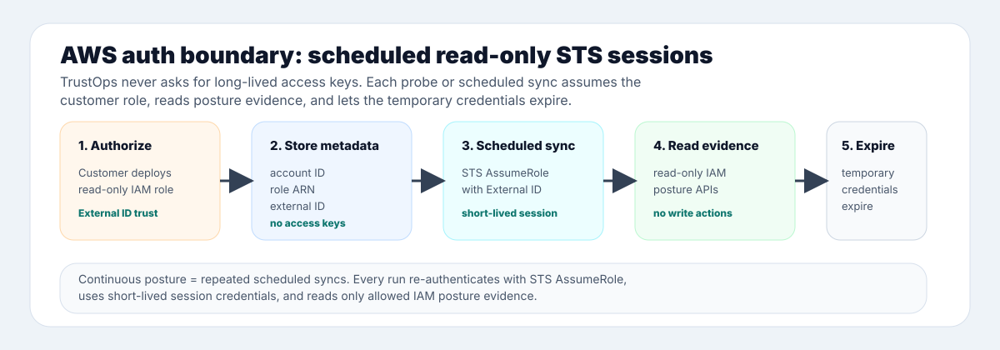

# TrustOps

<p align="center">
  
</p>

<p align="center">
  <strong>Continuous compliance in your cloud.</strong><br/>
  Read-only evidence collection, deterministic control tests, and audit-ready proof — in one self-hosted platform.
</p>

<p align="center">
  <a href="docs/PRODUCT_WALKTHROUGH.md"><strong>Product tour</strong></a> ·
  <a href="docs/CONNECTORS.md"><strong>Connectors</strong></a> ·
  <a href="docs/ARCHITECTURE.md"><strong>Architecture</strong></a> ·
  <a href="docs/api/AGENT_API.md"><strong>API & agents</strong></a> ·
  <a href="deploy/README.md"><strong>Deploy</strong></a>
</p>

<p align="center">
  
</p>

## What TrustOps does

One operating loop: **collect** evidence read-only, **evaluate** controls with
deterministic rules, **operate** the findings, **prove** posture with immutable
snapshots.

Regulatory requirements are consolidated into a
[Common Control Framework](docs/COMMON_CONTROL_FRAMEWORK.md): you operate one
safeguard, and it satisfies every requirement mapped to it across frameworks.
The catalog holds 942 requirements across 13 frameworks; run
`security-lakehouse frameworks safeguards` for current coverage.

Evidence stays in your environment. Models may summarize and prioritize; they do
not silently change evidence or decide pass/fail.

## Quickstart

```bash
# PyPI (Python 3.11+) — console + API
pip install 'trustops-security-data-lake[server]'
security-lakehouse platform seed-dev --lake ./lake
security-lakehouse serve --server --lake ./lake   # http://127.0.0.1:8787/console/

# Container image
docker run -p 8787:8787 ghcr.io/msaad00/trustops:latest

# Kubernetes (Helm)
helm install trustops deploy/helm/trustops
```

See [deploy/README.md](deploy/README.md) for production configuration, and the
[Product tour](docs/PRODUCT_WALKTHROUGH.md) for what to do once it is running.

<details>
<summary><b>Surfaces</b> — console, API, CLI, MCP, CI</summary>

| Surface          | Purpose                                                            |
| ---------------- | ------------------------------------------------------------------ |
| **Console**      | Posture, controls, evidence, findings, workflows, and audit room   |
| **API**          | Versioned `/api/v1` contract                                       |
| **CLI**          | Local pipelines, validation, snapshots, and server operations      |
| **MCP & agents** | Read posture and propose governed actions with approval boundaries |
| **CI**           | Block releases when posture or control-test thresholds regress     |

</details>

<details>
<summary><b>Connectors</b> — least-privilege, read-only</summary>

AWS · Azure · GCP · GitHub · GitLab · Okta · Snowflake · ClickHouse, plus the
scanner, ticketing, and AI-platform entries in
[`connectors/catalog.json`](connectors/catalog.json).

</details>

## Product preview

|                                         Trust Home                                         |                                         Audit room                                          |
| :----------------------------------------------------------------------------------------: | :-----------------------------------------------------------------------------------------: |
|  |  |

|                                           Evidence                                           |                                             Connectors                                              |
| :------------------------------------------------------------------------------------------: | :-------------------------------------------------------------------------------------------------: |
|  |  |

More views: [frameworks](docs/images/trustops-demo-frameworks.png) · [insights](docs/images/trustops-demo-insights.png) · [workflows](docs/images/trustops-demo-workflows.png) · [trust center](docs/images/trustops-demo-trust-center.png)

## Quick start

Requires Python 3.11+ and Node 22+ (the console is built from source; it is not
committed to the repository).

```bash
python -m venv .venv
source .venv/bin/activate
pip install -e ".[dev,server]"

make web-install web-build   # builds the console into src/security_lakehouse/web/dist

security-lakehouse fixtures load --company golden --out build/lakehouse
security-lakehouse db upgrade --lake build/lakehouse
security-lakehouse serve \
  --lake build/lakehouse \
  --server \
  --allow-insecure-no-auth \
  --port 8787
```

Open [http://127.0.0.1:8787/console/dashboard/](http://127.0.0.1:8787/console/dashboard/).

Skipping the console build leaves that URL a 404: the server mounts `/console/`
only when a built console is present, and falls back to a single status page.
`make demo-local` runs the whole sequence in one step.

`--allow-insecure-no-auth` is for local development only. Production deployments require configured authentication; see [server authentication](docs/SERVER_AUTH.md).

## Connect a live source

The default path is agentless and read-only; no pre-existing data lake is required.

- **Console:** open **Connectors**, choose a source, then run **Discover → Test → Enable → Sync**.
- **Headless:** follow the [connector setup playbook](docs/playbooks/HEADLESS_CONNECTOR_SETUP.md) for API, CLI, and MCP flows.
- **Existing lake:** connect Snowflake or ClickHouse when evidence already lives there.

Cloud connectors use short-lived provider credentials or workload identity. No connector requires pasted long-lived cloud keys. TrustOps stores non-secret identifiers, redacted fingerprints, sync history, and evidence hashes.

Connector security contracts:

- **AWS** uses STS AssumeRole, one External ID per deployed role, short-lived session credentials, and read-only IAM posture APIs. Temporary credentials expire after each session; TrustOps stores no long-lived access keys. Scale rollout with CloudFormation StackSets or Terraform workspaces; Bulk account import is the next operator surface.
- **Azure** uses a customer-owned Entra application, managed identity, or federated workload identity with Reader scope. Tokens are short-lived, and no Azure password or raw client secret is stored.
- **Snowflake** supports browser SSO for human proof or a read-only service identity with a key-pair or OAuth token reference held by the runtime secret manager. TrustOps stores account, role, and view identifiers — not passwords or private-key contents. Snowflake is the existing security-data-lake path.

<p align="center">
  
</p>

## Architecture

```text
read-only source → raw observation → normalized fact → deterministic evaluation
                 → finding/current posture → immutable snapshot → governed action
```

<p align="center">
  
</p>

The console, CLI, MCP server, agents, and CI gate share the same API and assessment engine. This keeps browser output and headless automation consistent.

## What ships

| Area              | Included                                                                             |
| ----------------- | ------------------------------------------------------------------------------------ |
| **Compliance**    | SOC 2, NIST AI RMF, FedRAMP, ISO, CIS AWS, HIPAA, PCI DSS, GDPR, and EU AI Act packs |
| **Evidence**      | Freshness SLAs, provenance, SHA-256 verification, tags, and saved views              |
| **GRC workflows** | Remediation, policies, attestations, vendor risk, access reviews, and approvals      |
| **Identity**      | OIDC, SAML, API keys, RBAC, tenant boundaries, and SCIM scaffolding                  |
| **Deployment**    | Local, Docker, Helm, EKS reference IaC, Snowflake, and ClickHouse                    |
| **Exports**       | Snapshots, executive PDF, trust shares, OpenAPI, MCP, and GitHub posture gate        |

See the [product shape](docs/PRODUCT_SHAPE.md) for shipped, partial, and planned capability status.

## Verify

```bash
make smoke       # backend, contracts, docs, brand, pipeline, API
make web-ci      # install, typecheck, production build
make security    # dependency audits and pre-commit checks
```

Regenerate documentation screenshots with `make demo-screenshots-full`.

## Repository map

```text
src/security_lakehouse/   assessment engine, API, auth, connectors, MCP
app/web/                  Next.js console
controls/ frameworks/     control catalogs, packs, and mappings
deploy/                   Docker, Helm, cloud, warehouse, and IaC examples
docs/                     product, architecture, operations, and API guides
```

## Documentation

- [Product walkthrough](docs/PRODUCT_WALKTHROUGH.md)
- [Architecture](docs/ARCHITECTURE.md)
- [Connector catalog](docs/CONNECTORS.md)
- [Continuous ingestion](docs/CONTINUOUS_INGESTION.md)
- [Audit readiness](docs/AUDIT_READINESS.md)
- [Agent API](docs/api/AGENT_API.md)
- [Deployment](docs/DEPLOYMENT.md)
- [Roadmap](ROADMAP.md)

Apache-2.0 licensed. Third-party visual assets and usage terms are documented in [THIRD_PARTY_ASSETS.md](docs/THIRD_PARTY_ASSETS.md).
