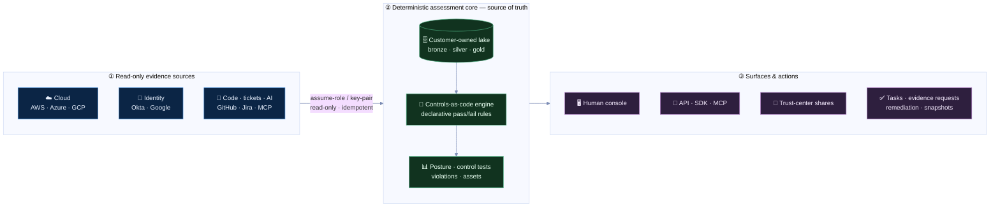
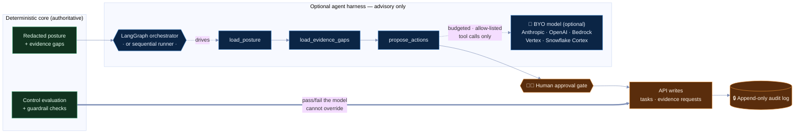
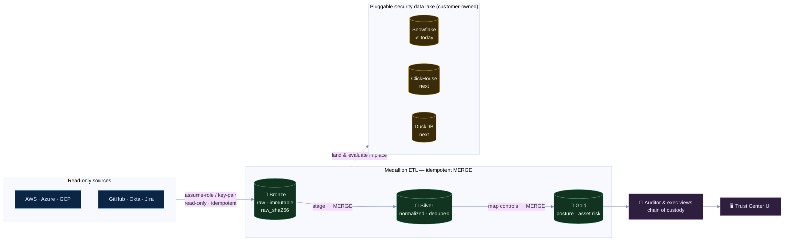

# TrustOps Security Data Lake

Open-source, self-hosted trust operations for security, AI governance, and
continuous compliance.

TrustOps turns cloud, identity, repository, runtime, ticketing, and AI-system
evidence into one evidence-backed control plane: live posture, framework
readiness, findings, remediation, workflow automation, immutable snapshots,
trust-center sharing, and headless agent APIs. Evidence stays in the customer's
lake, cloud, or local boundary.

<p align="center">
  
</p>

<p align="center">
  <a href="docs/PRODUCT_WALKTHROUGH.md"><strong>Product Walkthrough</strong></a>
  ·
  <a href="docs/ARCHITECTURE.md"><strong>Architecture</strong></a>
  ·
  <a href="docs/CONNECTORS.md"><strong>Connectors</strong></a>
  ·
  <a href="docs/FRAMEWORK_COVERAGE.md"><strong>Frameworks</strong></a>
  ·
  <a href="docs/api/AGENT_API.md"><strong>Agent API</strong></a>
  ·
  <a href="docs/SERVER_AUTH.md"><strong>Auth</strong></a>
</p>

## What You Get

TrustOps is built around one operating loop: collect evidence, evaluate
controls, route risk, automate follow-up, and share proof safely.

| Capability                   | What ships today                                                                                                | Primary users                    |
| ---------------------------- | --------------------------------------------------------------------------------------------------------------- | -------------------------------- |
| **Executive trust overview** | Live posture, framework readiness, failing tests, open risk, stale evidence, and fix-next queues.               | CISOs, GRC, security leads       |
| **Controls and frameworks**  | Versioned controls-as-code, source-linked framework registry, reviewed mappings, and asset applicability.       | GRC, auditors, control owners    |
| **Evidence lake**            | Bronze replay, silver normalized facts, gold posture outputs, hashes, freshness SLAs, and replayable artifacts. | Security engineering, audit ops  |
| **Findings and remediation** | Violations, owners, priorities, due dates, evidence requests, exceptions, and remediation tasks.                | Engineering owners, security ops |
| **Workflow automation**      | Directed workflows for checks, snapshots, evidence requests, owner routing, and guarded actions.                | Security operations, platform    |
| **Trust center**             | Scoped internal, auditor, and customer-facing summaries with expiring shares and redaction policy.              | Sales engineering, auditors      |
| **Headless agents**          | `/api/v1` envelopes, OpenAPI, Python SDK, MCP tools, persisted harness runs, approvals, and optional LangGraph. | CI, MCP clients, internal agents |

Current catalog scope is explicit: **9 framework families**, **37 seeded
controls**, **37 reviewed mappings**, **18 modeled asset types**, and **107
control-to-asset applicability links**. Coverage means seeded repo coverage,
not certification or full-framework audit coverage. See
[Framework Coverage](docs/FRAMEWORK_COVERAGE.md).

## Product Surfaces

<p align="center">
  
</p>

| Dashboard                                                                                                                                           | Trust Center                                                                                                                                    |
| --------------------------------------------------------------------------------------------------------------------------------------------------- | ----------------------------------------------------------------------------------------------------------------------------------------------- |
|  |  |

| Evidence                                                                                                                                  | Workflows                                                                                                                             |
| ----------------------------------------------------------------------------------------------------------------------------------------- | ------------------------------------------------------------------------------------------------------------------------------------- |
|  |  |

| Connectors                                                                                                                             | Frameworks                                                                                                                                                       |
| -------------------------------------------------------------------------------------------------------------------------------------- | ---------------------------------------------------------------------------------------------------------------------------------------------------------------- |
|  |  |

## Architecture

TrustOps keeps compliance truth deterministic. Agents and models can summarize,
prioritize, and propose actions, but the core assessment engine owns evidence
normalization, control evaluation, RBAC, tenant isolation, approvals,
idempotency, snapshots, hashes, and audit logs.

<p align="center">
  
</p>

**1. End-to-end flow** — read-only evidence becomes deterministic posture, then
surfaces and actions. The middle band is the source of truth; nothing downstream
can rewrite a control verdict.



**2. Where the agents — and LangGraph — sit.** The agent harness is _advisory and
optional_. LangGraph (or a plain sequential runner) only orchestrates reads of
already-redacted facts and _proposes_ actions; a bring-your-own model is an
optional step inside that graph, budgeted and constrained to an allow-listed tool
set. Every write passes a human approval gate, and the deterministic engine —
never the model — owns the verdict.



### Evidence Pipeline

Read-only ingestion lands immutable raw evidence, then a medallion of idempotent
`MERGE`s normalizes and maps it to controls. The lake sits behind one pluggable
sink interface (Snowflake implemented today; ClickHouse and an embedded store are
the next targets), so evidence stays in infrastructure the customer owns.



### Storage Modes

| Mode                       | Use when                                                                                        | Boundary                                 |
| -------------------------- | ----------------------------------------------------------------------------------------------- | ---------------------------------------- |
| **Local files + SQLite**   | Demo, CI, local audit, small self-hosted deployment.                                            | Filesystem and local DB.                 |
| **Existing evidence lake** | Security evidence already lives in Snowflake, object storage, SIEM exports, or similar systems. | Read-only views or scoped exports.       |
| **Telemetry lake**         | Runtime, detection, identity, repo, and scanner events need fast operational windows.           | ClickHouse-style hot event store.        |
| **Server mode**            | Teams need auth, tenants, API keys, OIDC/SAML, RBAC, request audit, and shared UI/API state.    | Customer-controlled server and database. |

TrustOps is not a hosted evidence silo. Production deployments should prefer
read-only access to existing evidence stores where possible. Direct source
tokens are for sources that are the authority for the evidence.

## Run Locally

```bash
python -m venv .venv
source .venv/bin/activate
pip install -e ".[dev,server]"

security-lakehouse fixtures load --company fintech --out build/lakehouse
security-lakehouse db upgrade --lake build/lakehouse
security-lakehouse serve \
  --lake build/lakehouse \
  --server \
  --allow-insecure-no-auth \
  --port 8787
```

Open the console:

```text
http://127.0.0.1:8787/console/dashboard/
```

The fixture data is synthetic and intentionally includes failing controls,
stale evidence, and open risk so the workbench has something real to evaluate.
If the browser reports connection refused, the server process is not running or
is on a different port.

Quick API probes:

```bash
curl -s http://127.0.0.1:8787/api/v1/posture/current | jq .
curl -s 'http://127.0.0.1:8787/api/v1/control-tests?result=fail&limit=10' | jq .
security-lakehouse openapi --out build/openapi.json
```

## Common Workflows

### Evaluate Evidence

```bash
security-lakehouse validate --raw data/raw/security_events.jsonl
security-lakehouse pipeline run --raw data/raw/security_events.jsonl --out build/lakehouse
security-lakehouse assessment status --lake build/lakehouse
security-lakehouse assessment tests --lake build/lakehouse
security-lakehouse assessment violations --lake build/lakehouse
security-lakehouse assessment snapshot --lake build/lakehouse --reason vendor_due_diligence
```

### Configure Connectors

```bash
security-lakehouse connectors validate
security-lakehouse connectors list
security-lakehouse connectors configure \
  --lake build/lakehouse \
  --connector-id github-security \
  --state enabled
security-lakehouse connectors sync \
  --lake build/lakehouse \
  --connector-id github-security \
  --repo OWNER/REPO \
  --fixture-dir tests/fixtures/github-governance
```

Executable connector runners currently cover GitHub security, AWS posture,
Okta identity, Google Workspace identity, GCP posture, Azure posture, Jira
ticketing, and Snowflake existing-lake reads. Other connector entries are
read-only lake contracts or managed evidence boundaries. See
[Connector And Access Model](docs/CONNECTORS.md).

### Run A Proof Scenario

```bash
security-lakehouse scenario run live-cloud-posture \
  --lake build/scenarios/live-cloud-posture \
  --connector azure-posture \
  --connector aws-posture \
  --connector snowflake-evidence-lake \
  --fixture azure-posture=tests/fixtures/azure \
  --fixture aws-posture=tests/fixtures/aws \
  --fixture snowflake-evidence-lake=tests/fixtures/snowflake
```

The scenario syncs connectors, rebuilds the lake, verifies integrity hashes,
freezes snapshots, runs a workflow DAG, and writes a JSON proof report. See
[TrustOps Scenarios](docs/SCENARIOS.md) for Azure, AWS, Snowflake, and full-live
commands.

### Run Workflow Automation

```bash
security-lakehouse workflow list --lake build/lakehouse
security-lakehouse workflow run --lake build/lakehouse --id <workflow_id>
```

Workflows are directed graphs: triggers, checks, and action nodes. Saved runs
write audit-friendly results; external egress is guarded by allowlists and
workflow policy.

### Use Headless Agents

```bash
security-lakehouse agents posture-review --lake build/lakehouse --role read_only
security-lakehouse agents soc-triage --lake build/lakehouse --role read_only
```

No LLM is required. The harness runs in `rules_only` mode by default. If a team
configures a model provider, model output can propose actions, but TrustOps
still enforces RBAC, redaction, approval, idempotency, and audit boundaries.

For MCP clients pointed at a deployed server:

```bash
export TRUSTOPS_API_URL="https://trustops.example.com"
export TRUSTOPS_API_KEY="..."
trustops-mcp
```

MCP tools can list/create/get persisted agent runs and approve stored decisions
through the authenticated `/api/v1/agent-runs` contract. See
[Agent Harness](docs/AGENT_HARNESS.md).

## Security And Trust Model

TrustOps treats compliance evidence as sensitive operational data.

| Control         | Default                                                                                                    |
| --------------- | ---------------------------------------------------------------------------------------------------------- |
| **Auth**        | Server mode requires authentication for non-health routes. Local insecure mode is explicit for demos only. |
| **Tenancy**     | Tenant-scoped lake paths and application-state rows; cross-tenant reads fail closed.                       |
| **RBAC**        | API keys, OIDC, and SAML resolve to the same identity, role, and scopes.                                   |
| **Secrets**     | Raw connector/API/model secrets are not stored in lake artifacts or returned through APIs.                 |
| **Integrity**   | Raw evidence and snapshots carry hashes; snapshots are linked through an append-only ledger.               |
| **Idempotency** | Connector sync, scheduler state, agent runs, and decision approvals are designed for safe retries.         |
| **Sharing**     | Trust-center shares are scoped, redacted, expiring, and role-aware.                                        |
| **Egress**      | External actions belong behind workflow policy and allowlists, not arbitrary agent output.                 |

Docs:
[Server Auth](docs/SERVER_AUTH.md),
[Data Model](docs/DATA_MODEL.md),
[Agent API](docs/api/AGENT_API.md),
[Agent Harness](docs/AGENT_HARNESS.md).

## Frameworks And Marks

Framework names are rendered as neutral text labels. TrustOps does not bundle
official certification marks, lookalike seals, regulator marks, or third-party
product logos unless usage rights, attribution, owner, and review date are
recorded in [Third-Party Asset Policy](docs/THIRD_PARTY_ASSETS.md).

This avoids implying that TrustOps, a fixture company, or a demo environment is
certified when it is not. See [Framework Coverage](docs/FRAMEWORK_COVERAGE.md)
for source links, readiness gates, and roadmap.

## Repo Map

```text
src/security_lakehouse/     CLI, pipeline, assessment engine, API, auth, server, MCP
app/web/                    Next.js TrustOps console
data/                       sample evidence and JSON schemas
connectors/                 source connector and access-boundary catalog
controls/                   implemented control catalog and policy rules
programs/                   compliance program and control-test catalog
frameworks/                 source-linked framework registry
deploy/                     Snowflake, ClickHouse, Docker, Helm, EKS assets
docs/                       architecture, product walkthrough, coverage, API docs
agent-skills/               guardrailed analyst skills for humans and agents
tests/                      pipeline, API, auth, policy, connector, UI contract tests
```

## Verification

```bash
make smoke
PYTHONPATH=src pytest -q
npm --prefix app/web run typecheck
npm --prefix app/web run build
```

The smoke target validates raw evidence, runs the pipeline, renders the
console, and executes the regression suite.
