# TrustOps Security Data Lake

<p align="center">
  
</p>

<p align="center">
  <strong>Continuous compliance in your VPC</strong> — connect AWS, Azure, GCP, Snowflake, and identity sources;<br/>
  evaluate controls deterministically; run audit-ready workflows; share proof with auditors.
</p>

<p align="center">
  <a href="docs/PRODUCT_WALKTHROUGH.md"><strong>Walkthrough</strong></a> ·
  <a href="docs/PRODUCT_SHAPE.md"><strong>Parity map</strong></a> ·
  <a href="docs/SHAREABLE_DEMO.md"><strong>Live demo</strong></a> ·
  <a href="docs/CONNECTORS.md"><strong>Connectors</strong></a> ·
  <a href="docs/ARCHITECTURE.md"><strong>Architecture</strong></a> ·
  <a href="CHANGELOG.md"><strong>Changelog</strong></a>
</p>

<p align="center">
  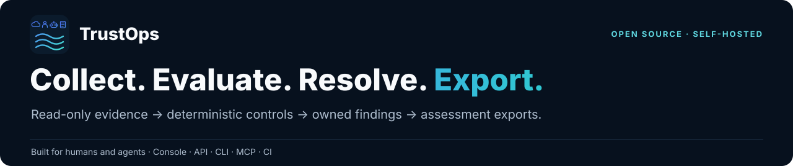
</p>

## Why teams pick TrustOps over managed GRC

Managed compliance SaaS excels at onboarding polish and integration breadth. TrustOps targets the same **audit loop** with a different contract: **your evidence lake**, **headless-first APIs**, and **deterministic control tests** — not connector pass/fail widgets alone.

|                       | Managed GRC SaaS             | TrustOps (self-host + headless)                         |
| --------------------- | ---------------------------- | ------------------------------------------------------- |
| **Evidence custody**  | Vendor-hosted                | Customer bronze/silver/gold lake                        |
| **Verdict engine**    | Platform widgets             | Lake-backed control tests + hashes                      |
| **Audit room**        | Mature UX                    | Live score, gaps, vendor/policy strips, SSE             |
| **Integrations**      | 100+ long tail               | AWS · Azure · GCP · Snowflake · GitHub · Okta + catalog |
| **Agents / CI / MCP** | Add-on                       | First-class `/api/v1` + MCP catalog                     |
| **Framework packs**   | Curated in-product           | SOC 2 · NIST AI RMF · FedRAMP · CIS AWS · ISO — as code |
| **HRIS / devices**    | Native                       | IdP + access reviews (gap)                              |
| **Billing / SCIM**    | Full SaaS                    | Hosted scaffold (P5 roadmap)                            |

**Honest score:** ~**75–80%** core GRC capability · ~**65–70%** managed-SaaS polish. Strongest where data residency, agents, and CI gates matter.

## Read-only connector ecosystem

Link real cloud and identity accounts — probe, discover scope, test, enable, sync. Vendor marks below use [Simple Icons](https://simpleicons.org/) (CC0) and public brand paths documented in [THIRD_PARTY_ASSETS.md](docs/THIRD_PARTY_ASSETS.md).

<p align="center">
  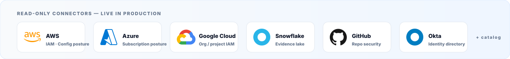
</p>

Deep-link examples (after `serve`):

| Source    | Console deep link                                      |
| --------- | ------------------------------------------------------ |
| AWS       | `/console/connectors/?connect=aws-posture`             |
| Azure     | `/console/connectors/?connect=azure-posture`           |
| GCP       | `/console/connectors/?connect=gcp-posture`             |
| Snowflake | `/console/connectors/?connect=snowflake-evidence-lake` |
| GitHub    | `/console/connectors/?connect=github-security`         |
| Okta      | `/console/connectors/?connect=okta-identity`           |

## Console preview

Screenshots below are captured from the **golden** fixture (37 controls, intentional gaps) via `make demo-screenshots-full`. They render on GitHub without a running server.

<p align="center">
  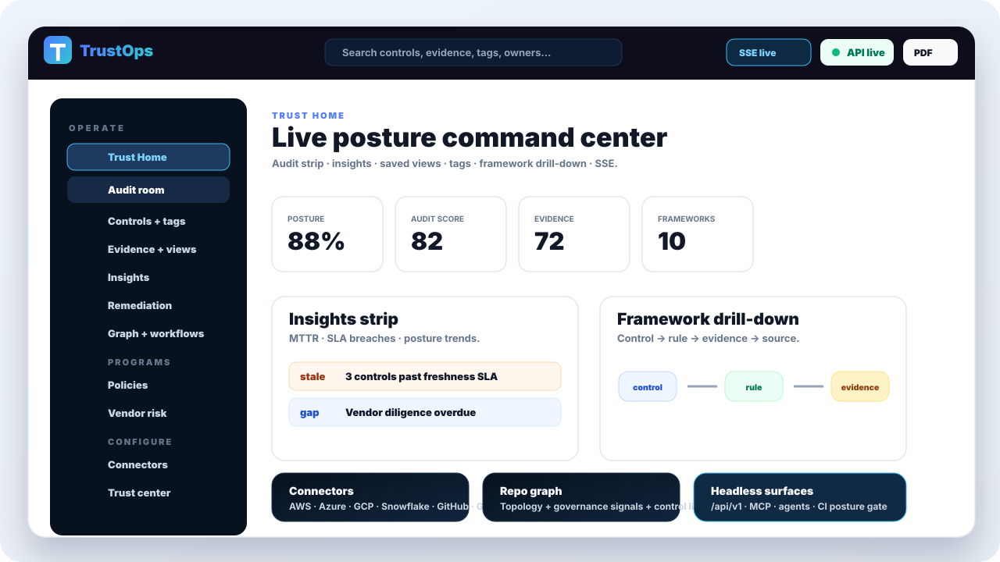
</p>

### Trust Home & audit workflow

|                      Trust Home — live posture, audit strip, insights                      |                      Audit room — score, gaps, vendor & policy strips                       |
| :----------------------------------------------------------------------------------------: | :-----------------------------------------------------------------------------------------: |
| 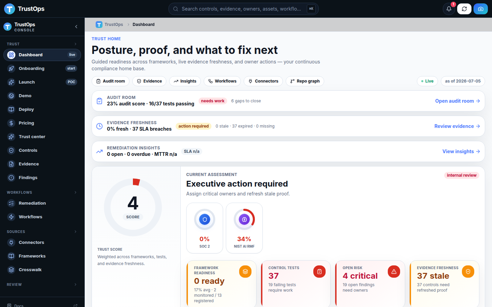 | 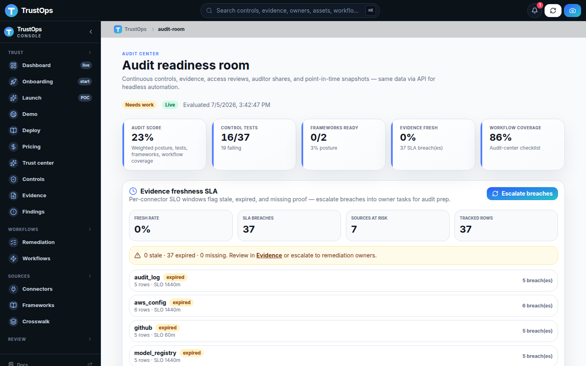 |

### Evidence, connectors & frameworks

|                  Evidence room — freshness SLA, saved views, tags                  |                       Connectors — AWS/Azure/GCP/Snowflake linking                        |
| :--------------------------------------------------------------------------------: | :---------------------------------------------------------------------------------------: |
| 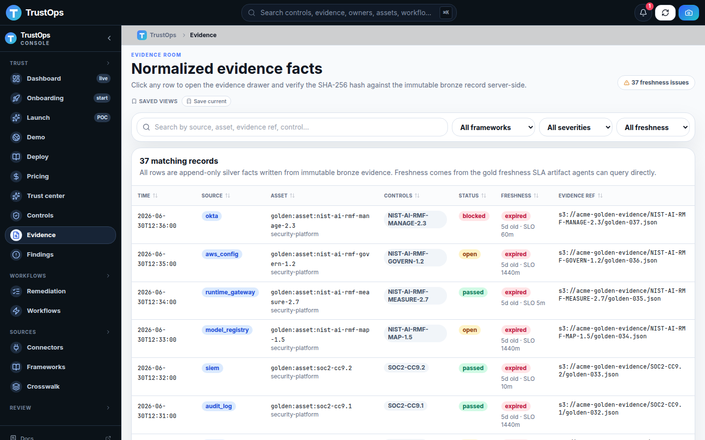 | 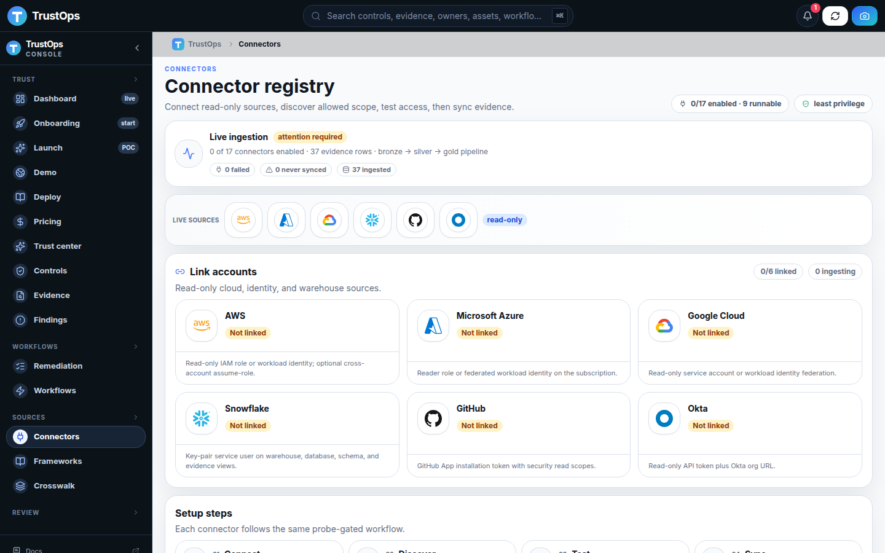 |

|                      Framework drill-down — control → rule → evidence                       |                           Insights — MTTR, SLA, posture trends                            |
| :-----------------------------------------------------------------------------------------: | :---------------------------------------------------------------------------------------: |
| 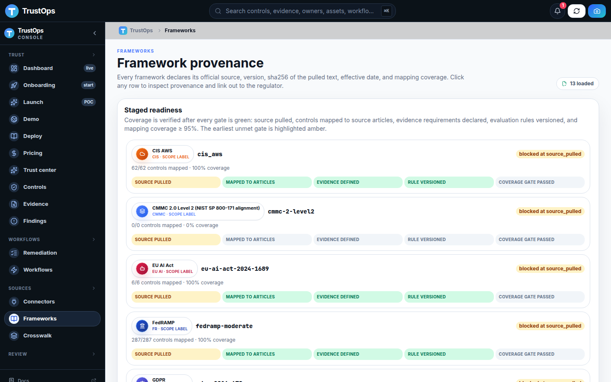 | 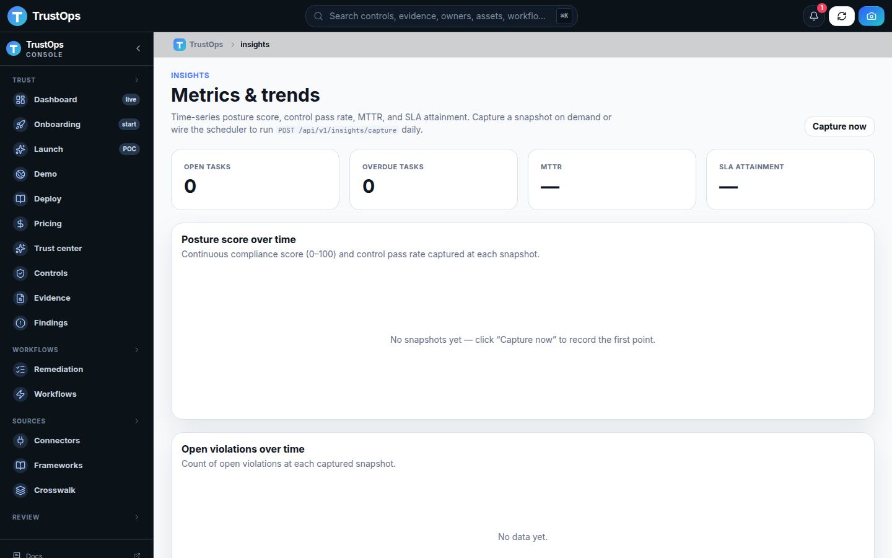 |

### Programs, automation & trust

|                               Policies & attestation                                |                                Vendor risk questionnaires                                |
| :---------------------------------------------------------------------------------: | :--------------------------------------------------------------------------------------: |
| 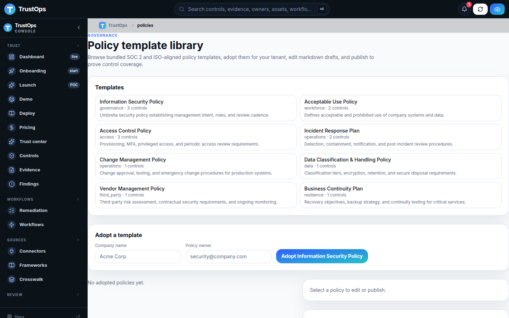 | 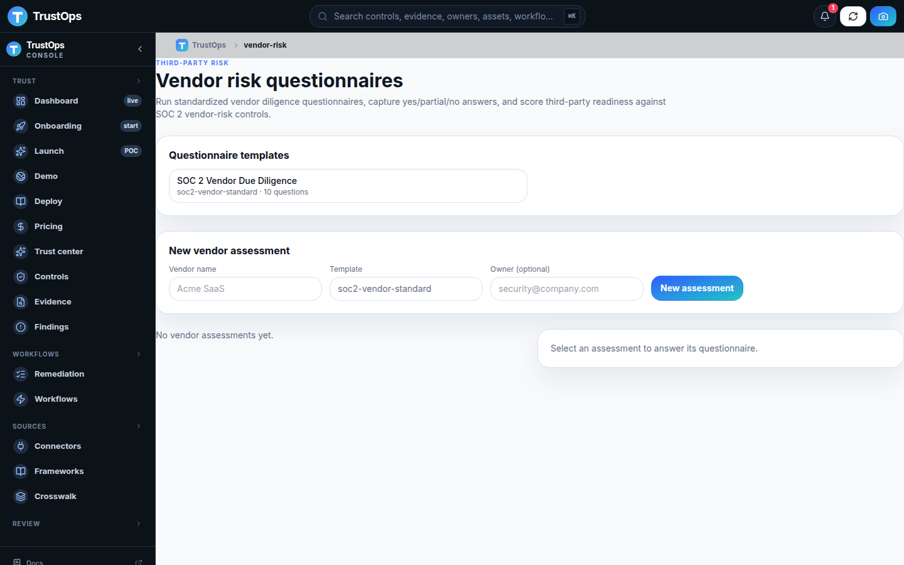 |

|                                     Workflow canvas                                     |                                  Trust center shares                                  |
| :-------------------------------------------------------------------------------------: | :-----------------------------------------------------------------------------------: |
| 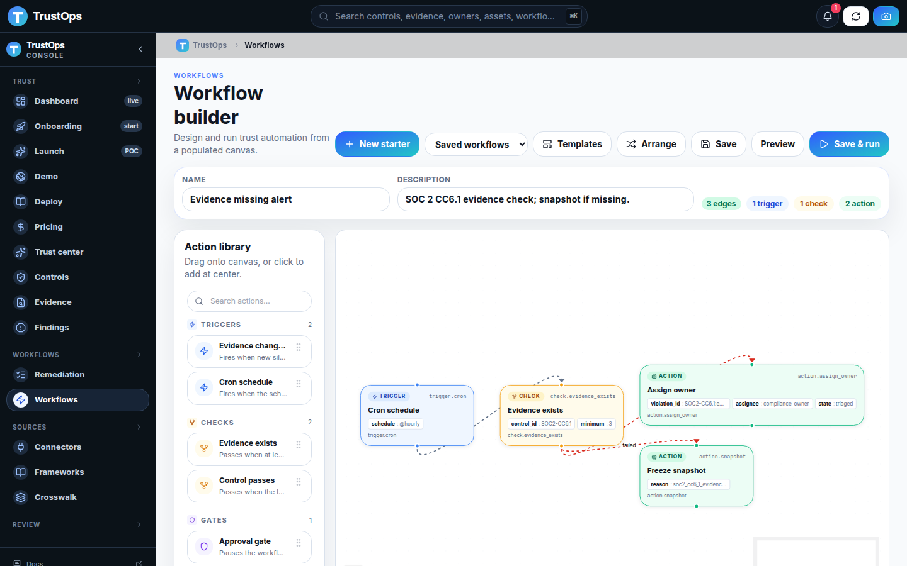 | 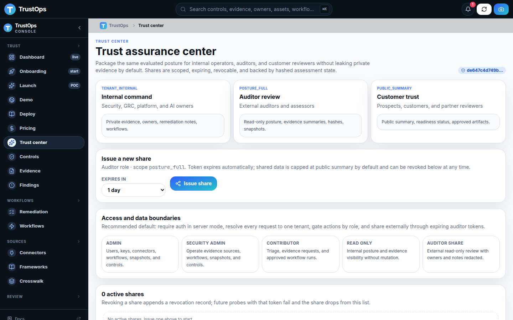 |

More: [onboarding](docs/images/trustops-demo-onboarding.png) · [graph](docs/images/trustops-demo-graph.png) · [access](docs/images/trustops-demo-auth.png) · [control drawer](docs/images/trustops-demo-control-drawer.png)

## What ships today

| Capability          | Highlights                                                                       |
| ------------------- | -------------------------------------------------------------------------------- |
| **Audit room**      | Readiness API, live SSE, gap checklist, snapshot timeline, executive PDF         |
| **Evidence**        | Freshness SLA, escalate-to-tasks, SHA-256 verify, saved views, cross-entity tags |
| **Frameworks**      | 10 families · **635** controls · drill-down chain · staged readiness gates       |
| **Vendor & policy** | Questionnaire MVP, diligence rollups, employee policy attestation                |
| **Remediation**     | Tasks, evidence requests, workflow canvas with approval gates                    |
| **Identity**        | OIDC/SAML, API keys, user admin, IdP role map, SCIM scaffold                     |
| **Headless**        | MCP tools, agent harness, GitHub Action posture gate, OpenAPI `/api/v1`          |

Full route map: [PRODUCT_WALKTHROUGH.md](docs/PRODUCT_WALKTHROUGH.md) · Gap tracker: [PRODUCT_SHAPE.md](docs/PRODUCT_SHAPE.md)

## How it works

```text
Connect → Sync → Evaluate → Remediate → Review → Share → Prove
```

Connectors ingest **read-only**. Bronze → silver → gold normalization feeds deterministic control tests. The console, API, workflows, and agents read the same lake — models may summarize, but **never own the verdict**.

<p align="center">
  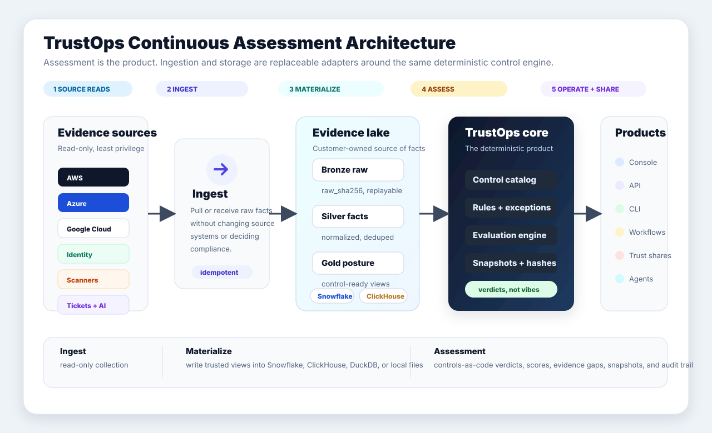
</p>

## Quick start (local demo)

```bash
python -m venv .venv && source .venv/bin/activate
pip install -e ".[dev,server]"

security-lakehouse fixtures load --company golden --out build/lakehouse
security-lakehouse db upgrade --lake build/lakehouse
security-lakehouse serve --lake build/lakehouse --server --allow-insecure-no-auth --port 8787
```

Open **http://127.0.0.1:8787/console/dashboard/** on the machine where you ran `serve`.

### Connect live cloud accounts

With credentials for your AWS, Azure, GCP, or Snowflake demo tenants:

1. Open **Connectors** and pick a source (or use deep links above).
2. Run **Probe → Discover → Test → Enable → Sync**.
3. Watch **Trust Home** and **Audit room** update from live evidence.

See [CONNECTORS.md](docs/CONNECTORS.md) and [SHAREABLE_DEMO.md](docs/SHAREABLE_DEMO.md) for hosted evaluator flows.

### API smoke

```bash
curl -s http://127.0.0.1:8787/api/v1/posture/current | jq .
curl -s http://127.0.0.1:8787/api/v1/platform/audit-readiness | jq .
security-lakehouse assessment snapshot --lake build/lakehouse --reason demo
```

### Regenerate README screenshots

```bash
make demo-screenshots-full   # golden fixture + Playwright → docs/images/trustops-demo-*.png
```

Production auth requires signed session cookies — see [SERVER_AUTH.md](docs/SERVER_AUTH.md).

## At a glance

|                |                                                                                       |
| -------------- | ------------------------------------------------------------------------------------- |
| **Release**    | `0.2.x` — OSS demos, self-hosted pilots, hosted scaffold                              |
| **Catalog**    | 10 framework families · **635** controls · 18 asset types                             |
| **Console**    | **28 routes** — dashboard, audit room, controls, evidence, connectors, …              |
| **Deployment** | Local · Helm self-hosted · managed hosted ([pricing](docs/DEPLOYMENT_AND_PRICING.md)) |
| **Surfaces**   | Console · `/api/v1` · SDK · MCP · agents ([API](docs/api/AGENT_API.md))               |

## Documentation

| Topic                 | Doc                                                                                   |
| --------------------- | ------------------------------------------------------------------------------------- |
| Parity vs managed GRC | [PRODUCT_SHAPE.md](docs/PRODUCT_SHAPE.md)                                             |
| Product tour          | [PRODUCT_WALKTHROUGH.md](docs/PRODUCT_WALKTHROUGH.md)                                 |
| Audit readiness       | [AUDIT_READINESS.md](docs/AUDIT_READINESS.md)                                         |
| Connectors            | [CONNECTORS.md](docs/CONNECTORS.md)                                                   |
| Framework packs       | [FRAMEWORK_PACKS.md](docs/FRAMEWORK_PACKS.md)                                         |
| Auth & tenancy        | [SERVER_AUTH.md](docs/SERVER_AUTH.md)                                                 |
| Shareable POC         | [SHAREABLE_DEMO.md](docs/SHAREABLE_DEMO.md)                                           |
| MCP cookbook          | [cookbook/MCP_EVIDENCE_AND_APPROVALS.md](docs/cookbook/MCP_EVIDENCE_AND_APPROVALS.md) |
| Roadmap               | [ROADMAP.md](ROADMAP.md)                                                              |

## Verify

```bash
make smoke
make demo-local          # golden fixture + serve on :8787
```

## Repo layout

```text
src/security_lakehouse/   pipeline, assessment, API, auth, MCP
app/web/                  Next.js console (28 routes)
controls/ frameworks/     catalogs and mappings
deploy/                   Helm, Docker, Snowflake, ClickHouse, EKS
docs/                     architecture, walkthrough, product shape
```

Framework labels in the UI are **neutral text marks** — not official certification logos. Connector tiles use permitted vendor marks per [THIRD_PARTY_ASSETS.md](docs/THIRD_PARTY_ASSETS.md).
