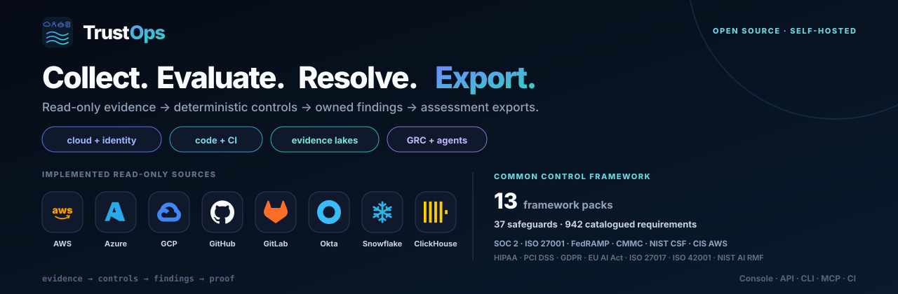
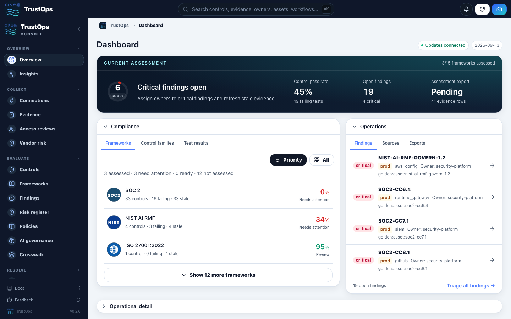
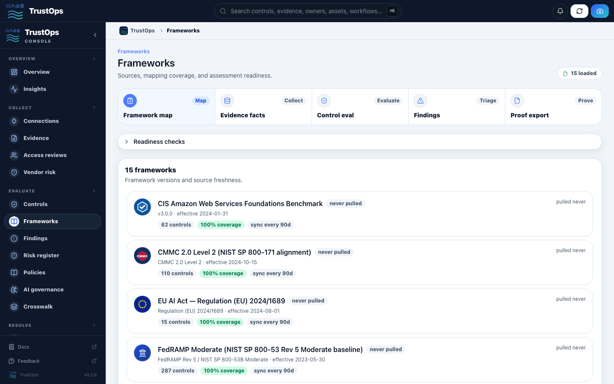
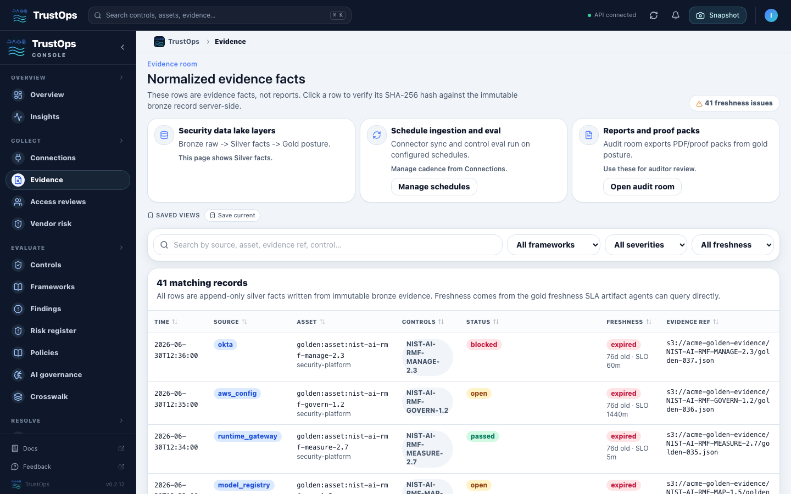
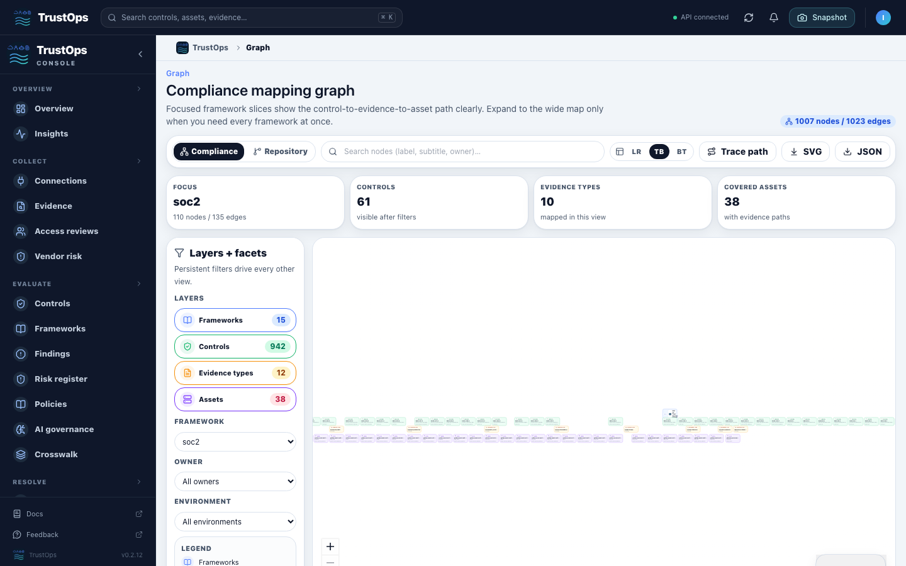
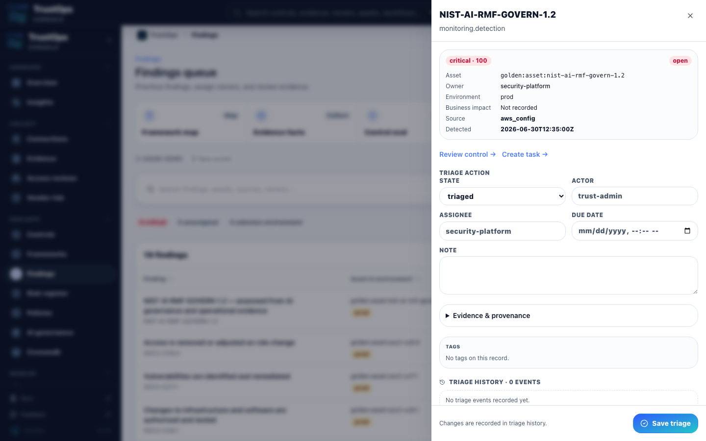

<p align="center">
  
</p>

<p align="center">
  <a href="https://pypi.org/project/trustops-security-data-lake/"></a>
  <a href="https://pypi.org/project/trustops-security-data-lake/"></a>
  <a href="https://github.com/msaad00/trustops-security-data-lake/actions/workflows/ci.yml"></a>
  <a href="LICENSE"></a>
</p>

<p align="center">
  <a href="#quick-start">Quick start</a> ·
  <a href="#how-it-works">How it works</a> ·
  <a href="#self-host">Self-host</a> ·
  <a href="#frameworks-and-common-controls">Frameworks</a> ·
  <a href="#scope">Scope</a> ·
  <a href="#explore">Explore</a>
</p>

**Open-source, self-hosted compliance automation.** Connect your stack,
continuously test controls, collect evidence, and hand auditors proof — running
in your own cloud or VPC, on your own data lake.

- **Your cloud, your evidence.** Evidence stays in storage you run. Data leaves
  only through the connectors, sinks, and model integrations you configure.
- **Two modes.** Ingest evidence into a lake you own, or connect read-only to the
  security lake you already run. [How it works](#how-it-works).
- **Deterministic and API-first.** Rules decide pass or fail, and every result
  links to its evidence; models may summarize or propose, never decide. The
  console, API, CLI, MCP server, and CI gates share one engine.

## Quick start

Use Python 3.11+, [uv](https://docs.astral.sh/uv/), and Node 22+:

```bash
git clone https://github.com/msaad00/trustops-security-data-lake.git
cd trustops-security-data-lake
uv sync --frozen --extra dev --extra server
make demo-local
```

Open [localhost:8787/console/dashboard/](http://127.0.0.1:8787/console/dashboard/).
This loads fixture data and disables authentication; for a shared environment,
see [Self-host](#self-host).

<details>
<summary><strong>Other setup paths</strong> — pip, CLI only, and MCP</summary>

Source install without uv:

```bash
python -m venv .venv && source .venv/bin/activate
pip install -e ".[dev,server]"
make web-install web-build
security-lakehouse fixtures load --company golden --out build/lakehouse --rebase-times
security-lakehouse db upgrade --lake build/lakehouse
security-lakehouse serve --lake build/lakehouse --server --allow-insecure-no-auth --port 8787
```

CLI and local lake only:

```bash
pip install trustops-security-data-lake
security-lakehouse fixtures load --company golden --out ./lake --rebase-times
security-lakehouse assessment status --lake ./lake
```

The same lake over MCP (stdio); see [headless GRC](docs/HEADLESS_GRC.md) for the trust boundary:

```bash
pip install 'trustops-security-data-lake[mcp]'
TRUSTOPS_LAKE=./lake trustops-mcp
```

</details>

## How it works

| Step         | What you do                                          | What you get                                        |
| ------------ | ---------------------------------------------------- | --------------------------------------------------- |
| **Collect**  | Connect a source with read-only access.              | Evidence with source, freshness, and provenance.    |
| **Evaluate** | Apply deterministic control rules.                   | Results tied to evidence and the evaluated catalog. |
| **Resolve**  | Assign findings, track fixes, and review exceptions. | Ownership and a record of follow-up decisions.      |
| **Export**   | Freeze an assessment and share reports.              | Evidence and assessment history for reviewers.      |

Evidence arrives in one of two modes; both feed the same rules and assessments.

| Mode              | How                                                                                                                          | Sources                                                                                                                                                    |
| ----------------- | ---------------------------------------------------------------------------------------------------------------------------- | ---------------------------------------------------------------------------------------------------------------------------------------------------------- |
| **Ingest**        | Read-only connectors pull evidence into a lake you own. No existing lake needed.                                             | AWS, Azure, GCP, GitHub, GitLab, Okta, Google Workspace, Jira, Intune, BambooHR, Rippling, Workday, Jamf\*, CrowdStrike Falcon\*, Kubernetes\*, KnowBe4\*  |
| **Existing lake** | Read-only queries against the lake you already run; a [lake mapping](docs/BRING_YOUR_OWN_LAKE.md) maps your existing tables. | Snowflake, ClickHouse, Databricks\*, Iceberg/Parquet\* (including Amazon Security Lake through OCSF presets), BigQuery\*, S3 object evidence, SIEM exports |

\* **Preview:** implemented and fixture-tested, not yet verified against a live
tenant. Lake mappings are experimental. The [connector catalog](docs/CONNECTORS.md)
lists all 28 contracts, 25 of them executable.

## Self-host

| Path                                                                                                 | Use it for                                                                          |
| ---------------------------------------------------------------------------------------------------- | ----------------------------------------------------------------------------------- |
| [Docker image](Dockerfile)                                                                           | One host: `docker run -p 8787:8787 -v $PWD/lake:/lake ghcr.io/msaad00/trustops:0.2` |
| [Helm chart](deploy/helm/trustops/)                                                                  | Kubernetes, with a persistent `/lake` volume and the scheduler.                     |
| [EKS Terraform](deploy/eks-terraform/)                                                               | Reference infrastructure for the chart on Amazon EKS.                               |
| [AWS](deploy/aws/) · [Azure](deploy/azure/) · [GCP](deploy/gcp/)                                     | Read-only posture roles for each cloud; no static keys.                             |
| [Snowflake](deploy/snowflake/) · [Databricks](deploy/databricks/) · [ClickHouse](deploy/clickhouse/) | Schema and bootstrap SQL for each existing-lake reader.                             |

Server mode requires [authentication](docs/SERVER_AUTH.md) (OIDC, SAML, or API
keys). Start with the [deployment guide](deploy/README.md).

## Frameworks and common controls

<!-- BEGIN README CCF SUMMARY -->

**17 framework packs · 78 reusable safeguards · 21 control families · 2,031 catalogued requirements.**

1,182 requirements have safeguard mappings; **350 have reviewed mappings**. Catalog coverage and evaluated customer posture are separate measures.

Control families: Identity and access · Data protection · Detection · Audit logging · Change management · Configuration management · Secure development · Secure architecture · Vulnerability management · Third-party risk · Risk management · Availability and recovery · Incident response · Governance · People security · Physical security · Network security · System maintenance · Processing integrity · Privacy · AI governance.

<!-- END README CCF SUMMARY -->

<table>
<tr>
<td align="center"><br><strong>SOC 2</strong></td>
<td align="center"><br><strong>ISO 27001 · 27017 · 27701 · 42001</strong></td>
<td align="center"><br><strong>NIST CSF 2.0</strong></td>
<td align="center"><br><strong>NIST AI RMF</strong></td>
</tr>
<tr>
<td align="center"><br><strong>CIS Controls · CIS AWS</strong></td>
<td align="center"><br><strong>CMMC 2.0</strong></td>
<td align="center"><br><strong>EU AI Act · GDPR</strong></td>
<td align="center"><strong>NIST 800-53 · NIST RMF<br>FedRAMP · HIPAA · PCI DSS</strong></td>
</tr>
</table>

A **reviewed** mapping has been confirmed by a person; a **proposed** one has
not, and neither is a certification. Some packs are limited: PCI DSS v4.0.1
covers its 12 principal requirements, ISO/IEC 27701:2025 seeds 10 of its 78
Annex A controls, and NIST RMF mappings are all proposed. SOC 1 is planned. The
[coverage matrix](docs/FRAMEWORK_COVERAGE.md) has the exact boundary per framework.

<details>
<summary><strong>How the Common Control Framework evaluates</strong></summary>

| Layer                  | What it represents                                                                   |
| ---------------------- | ------------------------------------------------------------------------------------ |
| **Control families**   | Risk domains that organize reusable safeguards.                                      |
| **Safeguards**         | Evidence requirements, ownership, review frequency, and executable evaluation rules. |
| **Framework mappings** | Links from safeguards to framework requirements, reviewed or proposed.               |
| **Assessment results** | Pass, fail, stale, or not evaluated, from the collected evidence.                    |

One safeguard can serve several frameworks. A requirement passes only when every
mapped safeguard passes; an unmapped requirement stays unmapped. Details:
[Common Control Framework](docs/COMMON_CONTROL_FRAMEWORK.md) ·
[executable catalog](controls/catalog.json). From the CLI:

```bash
security-lakehouse frameworks safeguards --format table
```

</details>

## Scope

| Area                     | Status                                                                                        |
| ------------------------ | --------------------------------------------------------------------------------------------- |
| License                  | Apache-2.0; no per-seat license. You run the infrastructure.                                  |
| Audit workflow           | Audit room, readiness, frozen assessments, trust-center shares, access reviews, OSCAL export. |
| Policies and vendor risk | MVP: policy templates with attestation, vendor questionnaires.                                |
| Automation               | Versioned API, CLI, MCP server, CI posture gate, webhooks.                                    |
| Integrations             | 25 executable connectors; add your own as a separately installed Python package.              |
| Not offered              | A managed service, or certification. Results are evidence for your auditor.                   |

Details: [product status](docs/PRODUCT_SHAPE.md) · [roadmap](ROADMAP.md).

## Explore

<details open>
<summary><strong>01 · Product tour</strong></summary>

Images show the bundled demo fixture, not live customer evidence.

<p align="center">
  <picture><source media="(prefers-color-scheme: dark)" srcset="docs/images/trustops-demo-dashboard-dark.png"></picture>
  <br><sub><strong>Overview</strong></sub>
</p>

<p align="center">
  <picture><source media="(prefers-color-scheme: dark)" srcset="docs/images/trustops-demo-frameworks-dark.png"></picture>
  <br><sub><strong>Frameworks</strong></sub>
</p>

<p align="center">
  <picture><source media="(prefers-color-scheme: dark)" srcset="docs/images/trustops-demo-evidence-dark.png"></picture>
  <br><sub><strong>Evidence</strong></sub>
</p>

<p align="center">
  <picture><source media="(prefers-color-scheme: dark)" srcset="docs/images/trustops-demo-graph-dark.png"></picture>
  <br><sub><strong>Graph</strong></sub>
</p>

<p align="center">
  <picture><source media="(prefers-color-scheme: dark)" srcset="docs/images/trustops-demo-triage-dark.png"></picture>
  <br><sub><strong>Triage</strong></sub>
</p>

[Walkthrough](docs/PRODUCT_WALKTHROUGH.md) ·
[Connections](docs/images/trustops-demo-connectors.png) ·
[Findings](docs/images/trustops-demo-findings.png) ·
[Remediation](docs/images/trustops-demo-remediation.png) ·
[Audit room](docs/images/trustops-demo-audit-room.png) ·
[Workflows](docs/images/trustops-demo-workflows.png) ·
[Trust center](docs/images/trustops-demo-trust-center.png)

</details>

<details>
<summary><strong>02 · Connector credentials</strong></summary>

In the console: **Connections → choose a source → Test → Enable → Sync**. For
automation, use the [headless setup playbook](docs/playbooks/HEADLESS_CONNECTOR_SETUP.md).
Cloud connectors use short-lived or workload identity credentials; for GCP,
Application Default Credentials (a service-account key file also works). SaaS
connectors use scoped API tokens or an integration-user login. Settings keep a
credential reference (an environment variable name or mounted secret file),
not the secret itself.

- **AWS** uses STS AssumeRole, one External ID per deployed role, short-lived session credentials, and read-only IAM posture APIs. Temporary credentials expire after each session; TrustOps stores no long-lived access keys. Roll out with CloudFormation StackSets or Terraform workspaces; Bulk account import is planned. See the [cloud setup guide](docs/LIVE_CLOUD_POC.md) and the [credential lifecycle](docs/images/trustops-aws-sts-lifecycle.svg).
- **Azure** uses a customer-owned Entra application, managed identity, or federated workload identity with Reader scope.
- **Snowflake** uses a read-only service identity with a key-pair or OAuth token reference. TrustOps stores identifiers, not passwords or private-key contents. Snowflake is the existing security-data-lake path.
- **GitHub** uses a GitHub App installation token, which expires within an hour.

Ship your own connector as a Python package: [adding connectors](docs/ADDING_CONNECTORS.md#shipping-a-connector-as-a-package).

</details>

<details>
<summary><strong>03 · Architecture and storage</strong></summary>

```text
Source → Raw evidence → Normalized facts → Control evaluation → Assessment
                                                ↓                  ↓
                                           Owned findings    Review / export
```

| Layer                   | Boundary                                                                                                |
| ----------------------- | ------------------------------------------------------------------------------------------------------- |
| Evidence and evaluation | Local JSONL and verified assessment generations; one writer per lake.                                   |
| Analytics and state     | SQLite mart (DuckDB optional) and an application database.                                              |
| Portable evidence       | Optional [Parquet export](docs/PARQUET_EXPORT.md) and [Iceberg REST publication](docs/ICEBERG_REST.md). |

Existing-lake readers are evidence sources; they do not host TrustOps.
[Architecture](docs/ARCHITECTURE.md) ·
[assessment generations](docs/ASSESSMENT_GENERATIONS.md) ·
[continuous ingestion](docs/CONTINUOUS_INGESTION.md)

</details>

<details>
<summary><strong>04 · API, agents, and CI</strong></summary>

| Surface                                 | Purpose                                                      |
| --------------------------------------- | ------------------------------------------------------------ |
| [API](docs/api/AGENT_API.md)            | Versioned `/api/v1` access for integrations.                 |
| [MCP](docs/HEADLESS_GRC.md)             | Read assessments and propose actions through governed tools. |
| [CI](docs/playbooks/CI_POSTURE_GATE.md) | Posture and control-test thresholds in delivery workflows.   |
| [OSCAL](docs/OSCAL_EXPORT.md)           | Component-definition and assessment-results JSON.            |
| [Webhooks](docs/WEBHOOKS.md)            | Signed event delivery to your systems.                       |

[Operator skill](agent-skills/trustops-operator/SKILL.md) ·
[specialist skills](agent-skills/FRAMEWORK_SKILLS.md) ·
[AI bill of materials](docs/AIBOM.md)

</details>

## Develop and verify

<details>
<summary><strong>Checks and repository layout</strong></summary>

```bash
make smoke       # backend, contracts, docs, brand, pipeline, API
make web-ci      # install, typecheck, production build
make security    # dependency audits and pre-commit checks
```

| Directory                               | Contents                                           |
| --------------------------------------- | -------------------------------------------------- |
| `src/security_lakehouse/`               | Assessment engine, API, auth, connectors, and MCP. |
| `app/web/`                              | Next.js console.                                   |
| `controls/`, `frameworks/`, `mappings/` | Rules, framework catalogs, and mappings.           |
| `deploy/`                               | Deployment and infrastructure examples.            |
| `docs/`                                 | Product, architecture, operations, and API guides. |

[Benchmarks](docs/BENCHMARKS.md) · [Third-party assets](docs/THIRD_PARTY_ASSETS.md) ·
[Apache-2.0 license](LICENSE)

</details>
