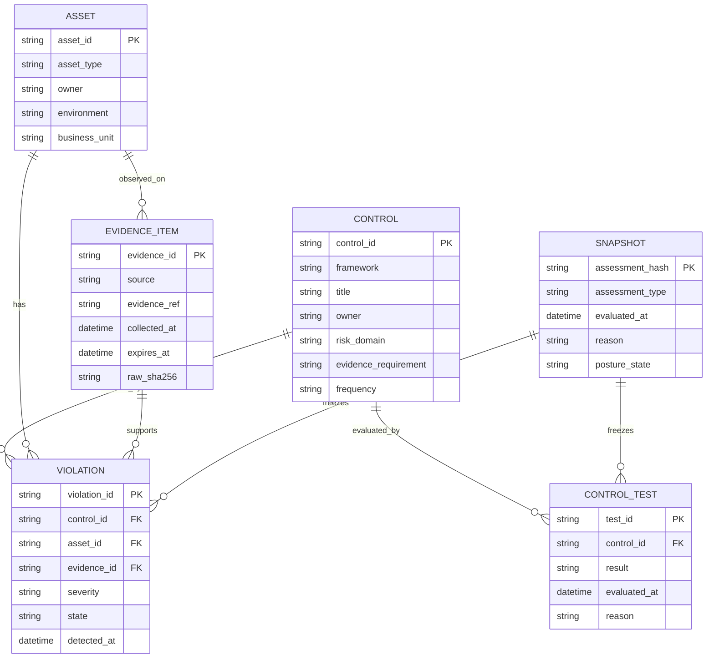

# Data Model

The model separates evidence from evaluation. Evidence describes what was
observed. Assessment describes what that evidence means for controls, risk, and
owners.

## Logical Model



## Physical Tables

| Layer   | Table/object               | Purpose                                         |
| ------- | -------------------------- | ----------------------------------------------- |
| Bronze  | `raw_events`               | immutable source evidence plus raw hash         |
| Silver  | `normalized_events`        | canonical evidence facts                        |
| Gold    | `control_posture`          | current control status and evidence coverage    |
| Gold    | `control_tests`            | control test results and confidence             |
| Gold    | `asset_risk`               | owner-ready risk queue                          |
| Gold    | `current_posture`          | live assessment result                          |
| Gold    | `assessment_snapshots`     | point-in-time assessment exports                |
| API     | `/api/posture/current`     | current posture contract                        |
| API     | `/api/violations`          | open violation contract                         |
| Catalog | `frameworks/registry.json` | official framework source registry              |
| Catalog | `controls/catalog.json`    | implemented controls with evidence requirements |

## Tenant Isolation

Every gold table — `control_posture`, `control_tests`, and `asset_risk` —
carries a `tenant_id` column as its first field, mirroring the silver
`normalized_events` table. This lets a single shared warehouse host multiple
tenants without one tenant's control posture, tests, or asset risk collapsing
into another's.

- **Shared warehouses (ClickHouse / Snowflake):** `tenant_id` is the leading
  key. In ClickHouse it leads every gold table's `ORDER BY` and is the
  partition key, so `ReplacingMergeTree` deduplicates within a tenant rather
  than across tenants (two tenants reporting the same `control_id` no longer
  last-writer-collapse). In Snowflake it leads the primary key and the
  clustering key.
- **File mart (SQLite / DuckDB):** the local mart is single-tenant per
  deployment. `run_pipeline(..., tenant_id="acme")` stamps every gold row with
  that value; it defaults to `"default"` so existing single-tenant pipelines
  are unaffected. The gold JSONL row shape is unchanged — `tenant_id` lives
  only on the warehouse DDL and the mart tables.

## Schema Contracts

- [Raw security event](../data/schemas/raw-security-event.schema.json)
- [Normalized event](../data/schemas/normalized-event.schema.json)
- [Current posture](../data/schemas/current-posture.schema.json)
- [Violation](../data/schemas/violation.schema.json)

## Control source provenance (auditable, not "vibes")

Every control in `controls/catalog.json` carries source-provenance so a mapping
can be traced to its origin and review:

| Field                           | Meaning                                                          |
| ------------------------------- | ---------------------------------------------------------------- |
| `framework_ref`                 | The framework + clause the control answers (e.g. `SOC 2 CC6.1`). |
| `source_url`                    | The authoritative source the control text/intent came from.      |
| `mapping_rationale`             | Why the chosen signal satisfies this control.                    |
| `reviewed_by` / `reviewed_date` | The review gate — who attested the mapping and when.             |
| `signal_source`                 | The silver table / connector feed the control test reads.        |

The catalog validator **requires** all six, and CI fails a control merged
without them. Inspect gaps any time:

```bash
security-lakehouse controls provenance   # exit 1 if any control lacks provenance
```

This is the answer to "how do you get the controls right?": every mapping is
source-linked, has a rationale, names its signal, and passes a provenance gate.
