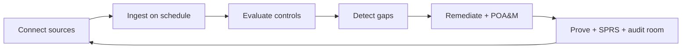

# GRC Automation Kingdom

TrustOps is built to be the **self-hosted GRC automation kingdom** — not a dashboard
that shows compliance, but a platform that **runs** compliance end-to-end on customer-owned
evidence lakes.

## The closed loop



Every step is reachable via **API**, **MCP**, **scheduler**, and **console** — same contract,
no special surfaces.

## What ships today

| Capability | Automation surface |
|------------|------------------|
| **851 controls** across 9 full framework packs | `frameworks sync-packs`, eval engine |
| **Continuous ingestion** (15m sync / 6h eval at scale) | Scheduler, connector runners, lake eval |
| **Remediation + evidence requests** | API, UI, MCP write tools |
| **POA&M + SPRS** (CMMC / NIST 800-171) | `GET /gov-compliance/sprs`, `POST /gov-compliance/poam/sync` |
| **Audit readiness score** | Platform API + audit room |
| **Agent harness** | MCP tools with approval gates |
| **Executive PDF** | Snapshot export |

## Headless agent verbs (new)

Agents with `TRUSTOPS_API_URL` + `TRUSTOPS_API_KEY` can now:

1. `get_sprs_score` — CMMC Level 2 SPRS from live control tests
2. `sync_poam_from_posture` — auto-create POA&M rows from failing practices
3. `list_poam_items` — milestone-tracked gov gaps
4. `create_remediation_task` / `create_evidence_request` — close the loop without console
5. `escalate_stale_evidence` — freshness → tasks (existing)

Example flow:

```text
escalate_stale_evidence → sync_poam_from_posture → create_remediation_task → create_evidence_request
```

## Kingdom gaps (honest)

| Gap | Status |
|-----|--------|
| HRIS / MDM personnel connectors | Roadmap (IdP + access reviews workaround today) |
| Pack-specific connector evidence hints | Next |
| FedRAMP 323-selected overlay | After Moderate baseline pack |
| Scheduled executive narrative packs | Snapshot PDF today |
| Billing / SCIM self-serve | P5 partial |

## Why we win

Managed GRC SaaS optimizes for **their** cloud and **their** auditors. TrustOps optimizes for:

- **Your lake** — evidence never leaves your boundary
- **Your agents** — MCP-first automation with human approval gates
- **Your frameworks** — full packs at 100% ID coverage, not seed catalogs
- **Your gov programs** — SPRS + POA&M native, not spreadsheet exports

See [HEADLESS_GRC.md](HEADLESS_GRC.md), [FRAMEWORK_PACKS.md](FRAMEWORK_PACKS.md), and [ROADMAP.md](../ROADMAP.md).
