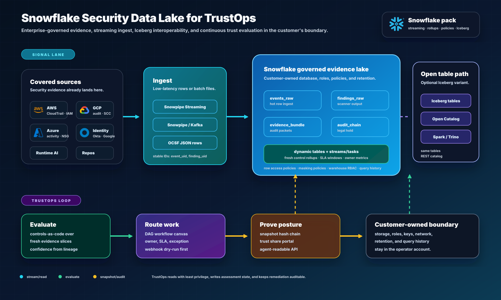

# Hero Security Data Lakes

This project tells a two-backend security analytics story:

| Backend    | Best fit                             | Security value                                                              |
| ---------- | ------------------------------------ | --------------------------------------------------------------------------- |
| Snowflake  | governed enterprise evidence lake    | auditor sharing, retention, RBAC, data clean rooms, cross-team reporting    |
| ClickHouse | high-volume telemetry analytics lake | fast runtime/security event analytics, detections, dashboards, aggregations |

The local pipeline remains the source of truth for the demo. It writes replayable
bronze/silver/gold artifacts and a SQLite mart so the project can run anywhere.
Snowflake and ClickHouse artifacts show how the same normalized model maps to
production-grade backends.

## Snowflake Story

Snowflake is the executive and audit-facing evidence lake:

- stores normalized evidence, control posture, and asset risk
- supports role-based access for security, audit, GRC, and leadership
- makes compliance exports straightforward through SQL views
- can retain immutable evidence pointers without copying sensitive payloads

Use Snowflake when the question is:

- "Can audit and GRC trust this evidence?"
- "Can business leaders slice risk by owner, product, and environment?"
- "Can we share controlled evidence with internal stakeholders?"



The live Snowflake connector is a read-existing-lake path. It reads
TrustOps-shaped evidence views with a least-privilege role, writes collected
rows into managed raw connector evidence, and lets the same pipeline rebuild
bronze, silver, gold, snapshots, and current posture. The connector does not
create Snowflake objects, mutate warehouse state, or require DDL privileges.

Primary artifacts:

- [Snowflake schema](../deploy/snowflake/schema.sql)
- [Snowflake connector model](CONNECTORS.md#connector-runner)
- [Dual-lakehouse diagram](diagrams/dual-lakehouse.md)

## ClickHouse Story

ClickHouse is the high-throughput security telemetry lake:

- stores normalized events and runtime security telemetry
- optimizes time-window, severity, source, and asset aggregations
- powers low-latency dashboards and investigation queries
- keeps high-cardinality runtime/event data cheap to query

Use ClickHouse when the question is:

- "What happened in the last 15 minutes?"
- "Which runtime policies are blocking risky agent behavior?"
- "Which assets and controls are trending worse at event scale?"

Primary artifacts:

- [ClickHouse schema](../deploy/clickhouse/schema.sql)
- [Local ClickHouse compose file](../deploy/clickhouse/docker-compose.yml)
- [Dual-lakehouse diagram](diagrams/dual-lakehouse.md)

## Portfolio Positioning

This is not just a dashboard. It demonstrates:

- security event modeling
- control mapping
- evidence lineage
- warehouse/lakehouse schema design
- operational analytics
- auditor-facing reporting
- agent-assisted investigation

The same event model can land in both warehouses:

```text
raw JSONL evidence
  -> bronze replay records
  -> silver normalized_events
  -> gold control_posture + asset_risk + metrics
  -> Snowflake governed evidence lake
  -> ClickHouse high-volume telemetry lake
```
