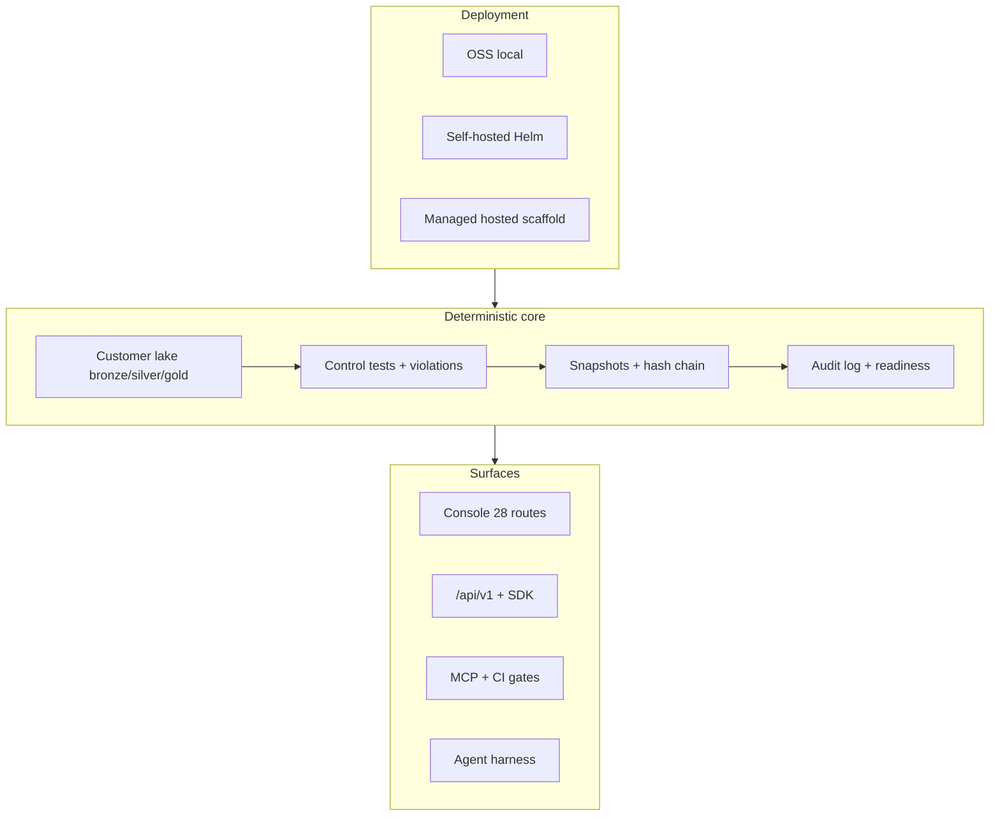

# Product Shape & Parity Map

Honest capability and UX reality for TrustOps v0.2.x — not marketing parity, but
where the platform sits versus **mature managed GRC SaaS** and what open issues
close each gap fastest.

Related: [TRUSTOPS_85_PLAN.md](TRUSTOPS_85_PLAN.md) (self-hosted bar) ·
[PRODUCT_WALKTHROUGH.md](PRODUCT_WALKTHROUGH.md) (shipped vs planned) ·
[PILOT_ROADMAP.md](PILOT_ROADMAP.md) (phase tracker) ·
[AUDIT_READINESS.md](AUDIT_READINESS.md) (audit workflow checklist)

## TL;DR

| Dimension             | Mature managed GRC SaaS     | TrustOps today                                              |
| --------------------- | --------------------------- | ----------------------------------------------------------- |
| **Product shape**     | Polished multi-tenant SaaS  | Self-hostable platform + optional hosted scaffold           |
| **Core GRC loop**     | Mature, turnkey             | Strong on controls, evidence, audit room, shares            |
| **UI/UX**             | Best-in-class consumer SaaS | Good foundation — Epic #96 largely shipped (~65–70% polish) |
| **Integrations**      | 100+ deep connectors        | Solid cloud/IdP core, narrower long tail                    |
| **Agents / API / CI** | Add-ons, limited vs core    | **Differentiator** — MCP, harness, headless-first           |
| **Data ownership**    | Vendor-hosted evidence      | **Customer lake** — major differentiator                    |

**Overall:** TrustOps is a credible **self-hosted / headless GRC platform** with
real audit-room depth. It is not yet a drop-in replacement for teams that want
fully managed compliance with HRIS, devices, and personnel out of the box.

## Product shape (two models, one core)



| Surface             | Primary user                | Value                                                  |
| ------------------- | --------------------------- | ------------------------------------------------------ |
| **Console**         | Security, GRC, auditors     | Connect sources, review posture, fix gaps, share trust |
| **API / CLI / MCP** | Engineers, CI, agents       | Sync, query, automate without the UI                   |
| **Agent harness**   | Optional AI or rules runner | Summarize gaps; approval-gated writes only             |
| **Hosted scaffold** | Teams wanting a live URL    | Signup, invites, usage limits — billing/SCIM partial   |

The assessment engine stays **model-independent**. LLMs orchestrate around
redacted facts; the engine owns normalization, control evaluation, snapshots,
hashes, RBAC, idempotency, and audit logs.

## Core GRC loop maturity

```text
Connect → Sync → Evaluate → Remediate → Review → Share → Prove
   │         │        │           │          │        │       │
   │         │        │           │          │        │       └─ Snapshots, PDF, trust shares, audit log
   │         │        │           │          │        └─ Audit room, access reviews, auditor role
   │         │        │           │          └─ Evidence requests, tasks, workflow canvas
   │         │        │           └─ Violations queue, remediation, vendor risk (MVP)
   │         │        └─ Deterministic control tests, framework readiness
   │         └─ Connector probe/sync, freshness signals
   └─ AWS/Azure/GCP/Snowflake/GitHub/Okta + catalog long tail
```

| Loop stage          | Maturity   | Notes                                                         |
| ------------------- | ---------- | ------------------------------------------------------------- |
| Connect & sync      | **Strong** | Executable runners for core cloud/IdP; catalog for long tail  |
| Evaluate            | **Strong** | Lake-backed tests, not connector pass/fail widgets only       |
| Remediate           | **Good**   | Tasks, evidence requests, workflow canvas with approvals      |
| Audit review        | **Good**   | Audit room, readiness API, access reviews, executive PDF      |
| Share & prove       | **Good**   | Trust-center shares, snapshots, hash chain, auditor redaction |
| Personnel / devices | **Weak**   | IdP + access reviews workaround; no native HRIS/MDM           |
| Policy program      | **Good**   | Template library + employee attestation MVP shipped           |
| SaaS polish         | **Good**   | Trust Home, audit room SSE, saved views, tags, drill-down     |

## Console surface (28 routes)

| Route                                                       | Purpose                                           |
| ----------------------------------------------------------- | ------------------------------------------------- |
| `/console/dashboard/`                                       | Trust Command Center — posture, KPIs, audit strip |
| `/console/audit-room/`                                      | Audit score, gaps, workflow checklist             |
| `/console/controls/`                                        | Control workbench                                 |
| `/console/evidence/`                                        | Evidence room                                     |
| `/console/violations/`                                      | Finding queue                                     |
| `/console/remediation/`                                     | Tasks and evidence requests                       |
| `/console/frameworks/`                                      | Framework readiness                               |
| `/console/connectors/`                                      | Source linking + sync health                      |
| `/console/access-reviews/`                                  | Certification campaigns                           |
| `/console/policies/`                                        | Policy template library                           |
| `/console/vendor-risk/`                                     | Vendor questionnaires (MVP)                       |
| `/console/trust-center/`                                    | Share management                                  |
| `/console/audit-log/`                                       | Unified request audit                             |
| `/console/agents/`                                          | Agent harness runs                                |
| `/console/automation/`                                      | Workflow canvas                                   |
| `/console/graph/`                                           | Compliance graph workbench                        |
| `/console/insights/`                                        | Trends and metrics                                |
| `/console/auth/`                                            | API keys, users, invites                          |
| `/console/onboarding/`                                      | First-run wizard                                  |
| `/console/deploy/`                                          | OSS / self-hosted / hosted                        |
| `/console/demo/`                                            | Evaluator landing                                 |
| + login, pricing, POC, risks, crosswalk, public trust token |

## Parity scorecard (honest — not for investors)

Rough comparison vs mature managed GRC SaaS on capability + UX reality:

| Area                       | vs managed SaaS | TrustOps today                                               |
| -------------------------- | --------------- | ------------------------------------------------------------ |
| Audit room + readiness     | Strong          | **Shipped** — live SSE, gaps, vendor/policy strips           |
| Evidence freshness SLA     | Strong          | **Shipped** — summary, escalate, audit panel                 |
| Vendor diligence + policy  | MVP parity      | **Shipped** — questionnaires + attestation rollups           |
| Saved views + tags         | Good            | **Shipped** — controls, violations, evidence + tag filter    |
| Framework drill-down       | Good            | **Shipped** — control → rule → evidence → source             |
| Live SSE updates           | Good            | **Shipped** — posture + audit-readiness stream               |
| Integrations long tail     | Behind          | AWS/Azure/GCP/Snowflake/GitHub/GitLab/Okta live; #22/#23 repo graph |
| HRIS / devices / personnel | Behind          | IdP + access reviews workaround                              |
| Billing / full SCIM        | Behind          | P5 hosted scaffold                                           |
| Premium onboarding polish  | Behind          | Wizard shipped; polish incremental                           |

## Parity scorecard (detailed)

Rough comparison vs mature managed GRC SaaS on capability + UX reality:

| Area                        | vs mature SaaS | TrustOps strength                                    |
| --------------------------- | -------------- | ---------------------------------------------------- |
| SOC 2 / ISO control library | ~80%           | Depth good; framework packs as code                  |
| Continuous monitoring       | ~75%           | Core cloud/IdP connectors runnable                   |
| Auditor experience          | ~70%           | Trust shares, PDF, audit room trends; no marketplace |
| Personnel / devices / HR    | ~30%           | Workarounds only                                     |
| Policy program              | ~70%           | Templates + attestation MVP                          |
| Vendor risk                 | ~65%           | Questionnaires + audit-room rollups                  |
| Self-host / API / agents    | **~120%**      | Ahead — they don't lead here                         |
| SaaS polish / onboarding    | ~65–70%        | #96 shipped; incremental polish remains              |

## Where TrustOps matches well (shipped)

These are real surfaces — not roadmap slides:

- **Audit workflow (headless + UI)** — continuous control tests, audit readiness API,
  audit room, trust shares, auditor role redaction, access reviews, evidence
  requests → remediation, point-in-time snapshots, unified audit log, executive PDF
- **Framework depth** — SOC 2, NIST AI RMF, FedRAMP foundation, CIS AWS,
  ISO 27001/42001 packs
- **Identity & access** (PR [#345](https://github.com/msaad00/trustops-security-data-lake/pull/345)) —
  user/role admin, API-key → browser session, IdP group → role mapping, SCIM Users
  scaffold
- **Deploy transparency** — Helm, EKS terraform, `/console/deploy`, OSS positioning

## Where mature SaaS is still ahead

### 1. UI/UX polish ([#96](https://github.com/msaad00/trustops-security-data-lake/issues/96))

Managed GRC products feel like finished consumer apps: guided onboarding, empty
states, microcopy, notification center, mobile-friendly auditor flows, integrated
help.

TrustOps has dark mode, Trust Command Center, audit strip, workflow canvas,
connector drawers — but not the same visual refinement, marketing-grade empty
states, or zero-config wow on first login.

### 2. Integration long tail

Mature SaaS: HRIS, device MDM, ticketing, training — hundreds of pre-built checks.

TrustOps: strong AWS / Azure / GCP / Snowflake / GitHub / Okta paths with vendor
marks in-console; open connector catalog; read-only posture. Gaps: personnel/HRIS,
device MDM, pen-test coordination ([#22](https://github.com/msaad00/trustops-security-data-lake/issues/22), [#23](https://github.com/msaad00/trustops-security-data-lake/issues/23)).

### 3. Compliance OS convenience

| Feature                   | Mature SaaS  | TrustOps                                            |
| ------------------------- | ------------ | --------------------------------------------------- |
| Policy employee sign-off  | Native       | **MVP shipped** — publish + acknowledgment tracking |
| Personnel tracking        | Native       | IdP + access reviews                                |
| Auditor marketplace       | Yes          | BYO auditor + trust share                           |
| Device inventory          | Integrations | Connector evidence only                             |
| Billing / self-serve SaaS | Native       | Pricing/signup scaffold; Stripe not shipped         |
| SCIM lifecycle            | Full         | Scaffold + env bearer (PR #345)                     |

### 4. Visual analytics ([#18](https://github.com/msaad00/trustops-security-data-lake/issues/18))

Insights/timeseries and posture trend exist — but not the rich trend/compliance
timeline UX used for exec and auditor storytelling ([#15](https://github.com/msaad00/trustops-security-data-lake/issues/15)).

## Where TrustOps is ahead (differentiators)

Hard for classic GRC SaaS to match:

| Differentiator                | Why it matters                                                |
| ----------------------------- | ------------------------------------------------------------- |
| **Self-host + customer lake** | Evidence in bronze/silver/gold — not a vendor silo            |
| **Headless-first**            | Same `/api/v1` for console, MCP, CI gates, agents             |
| **Agent harness**             | Governed runs, approval-gated writes, LangGraph orchestration |
| **Deterministic assessment**  | Control tests from lake pipeline, not widget pass/fail only   |
| **Framework packs as code**   | `frameworks sync-packs`, custom frameworks, crosswalk         |
| **Interoperable scale**       | Correlation IDs, idempotency, RBAC on every route             |

If the buyer cares about data residency, agents in the IDE, or CI-enforced posture,
TrustOps is stronger. If they want sign-up and pass SOC 2 in 90 days with zero
engineering, managed SaaS still wins on packaging.

## Tools & app surface today

| Layer       | TrustOps today                                                                                       |
| ----------- | ---------------------------------------------------------------------------------------------------- |
| **Console** | Full GRC shell: dashboard → audit room → controls → evidence → frameworks → connectors → remediation |
| **CLI**     | Pipeline, seed-dev, auth, frameworks sync, executive PDF, connector validate                         |
| **API**     | `/api/v1/*` — posture, controls, audit-readiness, audit-log, remediation, agents                     |
| **MCP**     | Posture, controls, violations, audit log, audit readiness, snapshots, workflows (expanding)          |
| **CI**      | GitHub Action posture gate                                                                           |

## Issue map — what closes the gap fastest

Open issues ranked by impact on **turnkey core GRC loop + premium UX**:

| Priority | Issue                                                                        | Closes                                       | Status                            |
| -------- | ---------------------------------------------------------------------------- | -------------------------------------------- | --------------------------------- |
| **P0**   | [#96](https://github.com/msaad00/trustops-security-data-lake/issues/96) Epic | Premium GRC SaaS feel — biggest UX gap       | **Mostly shipped** (#89–#95, #91) |
| **P0**   | [#14](https://github.com/msaad00/trustops-security-data-lake/issues/14)      | Source-linked framework/control expansion    | Open                              |
| **P1**   | [#13](https://github.com/msaad00/trustops-security-data-lake/issues/13)      | Evidence freshness SLA + stale → remediation | **Shipped**                       |
| **P1**   | [#15](https://github.com/msaad00/trustops-security-data-lake/issues/15)      | Audit snapshot room + reviewer trust center  | **Shipped** (trends + timeline)   |
| **P1**   | [#18](https://github.com/msaad00/trustops-security-data-lake/issues/18)      | Product-grade topology, trend, workflow viz  | Open                              |
| **P1**   | [#22](https://github.com/msaad00/trustops-security-data-lake/issues/22)      | GitHub/GitLab repo governance connector      | **Shipped** (GitLab UI + governance sync) |
| **P1**   | [#23](https://github.com/msaad00/trustops-security-data-lake/issues/23)      | Repository topology graph workbench          | **Shipped** (demo data + inspector)       |
| **P1**   | [#16](https://github.com/msaad00/trustops-security-data-lake/issues/16)      | Headless agent workbench + guarded skills    | Partial                           |
| **Ship** | [#345](https://github.com/msaad00/trustops-security-data-lake/pull/345)      | Identity/admin parity for enterprise SSO     | PR open                           |

### Epic #96 breakdown (experience uplift)

| Sub-issue | Surface                    | Bar                                |
| --------- | -------------------------- | ---------------------------------- |
| #89       | Design system + Trust Home | **Shipped**                        |
| #90       | Workflow canvas            | **Shipped**                        |
| #91       | Framework drill-down       | **Shipped**                        |
| #92       | Continuous-eval layer      | **Shipped** (SSE)                  |
| #93       | Headless parity            | **Shipped** (MCP catalog expanded) |
| #94       | Tags + saved views         | **Shipped**                        |
| #95       | Metrics & insights         | **Shipped**                        |

## Recommended execution order

Stack PRs to maximize “feels turnkey” signal per unit of work:

```text
1. Merge #345 (identity/admin)           → enterprise SSO parity
2. Ship #13 (evidence freshness SLA)     → audit room automation loop
3. #15 + #18 (audit trends + viz)        → exec/auditor storytelling
4. #96 P0 (#89 Trust Home, #90 canvas)   → premium first impression
5. #22 + #23 (repo graph)                → code governance depth
6. #14 (framework expansion)             → control library breadth
7. P5 billing/SCIM full lifecycle        → hosted SaaS completeness
```

Each PR should pass the pre-push gate: pre-commit, ruff, compileall, pytest,
web typecheck/build, `gh pr checks`.

## Target: interoperable, secure, scale, turnkey

| Pillar               | Today                       | Turnkey target                        | Primary issues     |
| -------------------- | --------------------------- | ------------------------------------- | ------------------ |
| **Interoperable**    | Strong API/MCP/CI           | Full OpenAPI + MCP catalog parity     | #93, #16           |
| **Secure**           | Auth/RBAC/audit spine       | SCIM lifecycle, signed cookies always | #345, P5           |
| **Scale**            | Audit-scale synth + HA docs | Multi-replica read paths proven       | ops runbooks       |
| **Turnkey core GRC** | Audit room + shares strong  | Freshness SLA, trends, premium UX     | #13, #15, #18, #96 |
| **Premium UI/UX**    | ~65–70%                     | ~80–85% managed-SaaS bar              | polish, #22/#23    |

See [TRUSTOPS_85_PLAN.md](TRUSTOPS_85_PLAN.md) for the self-hosted 85% exit
criteria and [ROADMAP.md](../ROADMAP.md) for shipped vs remaining milestones.
