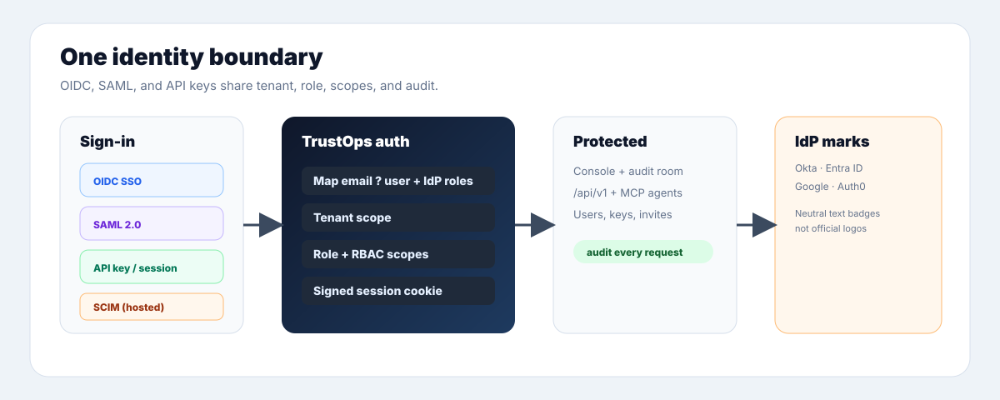

# Server Auth

TrustOps server mode has one identity model:

```text
API key, OIDC login, or SAML login
  -> user
  -> tenant
  -> role
  -> RBAC scopes
  -> request audit event
```

Local mode stays zero-dependency. These settings apply only when running the
FastAPI server surface from `trustops-security-data-lake[server]`.

## API Keys

API keys are for agents, CI, and service accounts. The database stores only a
SHA-256 token hash. Raw key material is returned once by the authenticated API
creation endpoint.

```bash
security-lakehouse platform seed-dev --lake build/lakehouse
security-lakehouse auth list-keys --lake build/lakehouse --tenant-slug acme
```

## OIDC

OIDC is the preferred human-login path when the company identity provider
supports it.

```bash
export TRUSTOPS_OIDC_ISSUER="https://idp.example.com"
export TRUSTOPS_OIDC_CLIENT_ID="trustops"
export TRUSTOPS_OIDC_CLIENT_SECRET="..."
export TRUSTOPS_OIDC_TENANT_SLUG="acme"
export TRUSTOPS_OIDC_AUTO_PROVISION="false"
export TRUSTOPS_SESSION_SECRET="replace-with-32-byte-random-secret"
```

Endpoints:

| Endpoint                    | Purpose                                           |
| --------------------------- | ------------------------------------------------- |
| `GET /api/v1/auth/methods`  | Discover configured browser login methods, IdP host, setup hints, and API-key headless access |
| `GET /api/v1/auth/whoami`   | Current session user, tenant, role, and scopes    |
| `GET /api/v1/auth/login`    | Start OIDC login                                  |
| `GET /api/v1/auth/callback` | Complete OIDC login and issue the browser session |
| `POST /api/v1/auth/logout`  | Revoke the browser session                        |

The console **Access** page (`/console/auth/`) and sign-in page render the same
`auth.methods` payload with neutral IdP marks (Okta, Entra ID, Google, SAML) —
not official vendor logos. See [THIRD_PARTY_ASSETS.md](THIRD_PARTY_ASSETS.md).

<p align="center">
  
</p>

Mermaid diagrams: [auth-identity.md](diagrams/auth-identity.md)

## SAML

SAML is the enterprise fallback for identity providers that do not expose OIDC
to the TrustOps deployment. It resolves into the same browser session and RBAC
context as OIDC.

```bash
export TRUSTOPS_SAML_SP_ENTITY_ID="https://trustops.example.com/api/v1/auth/saml/metadata"
export TRUSTOPS_SAML_ACS_URL="https://trustops.example.com/api/v1/auth/saml/acs"
export TRUSTOPS_SAML_IDP_ENTITY_ID="https://idp.example.com/saml"
export TRUSTOPS_SAML_IDP_SSO_URL="https://idp.example.com/saml/sso"
export TRUSTOPS_SAML_IDP_X509_CERT="-----BEGIN CERTIFICATE-----..."
export TRUSTOPS_SAML_TENANT_SLUG="acme"
export TRUSTOPS_SAML_AUTO_PROVISION="false"
```

Endpoints:

| Endpoint                         | Purpose                                                 |
| -------------------------------- | ------------------------------------------------------- |
| `GET /api/v1/auth/saml/login`    | Start SAML login                                        |
| `POST /api/v1/auth/saml/acs`     | Assertion consumer service; validates the SAML response |
| `GET /api/v1/auth/saml/metadata` | Service-provider metadata for identity-provider setup   |

If any SAML environment variable is present, all required SAML variables must
be present. The server fails closed instead of starting with a partial SSO
boundary.

## Roles

| Role             | Access                                                      |
| ---------------- | ----------------------------------------------------------- |
| `admin`          | Full access, including user and API key administration      |
| `security_admin` | Connector, workflow, snapshot, and control operations       |
| `contributor`    | Evidence request, workflow action, and triage operations    |
| `auditor`        | Read-only, with owner, credential, and note fields redacted |
| `read_only`      | Internal read-only view without mutation                    |

All non-health `/api/v1/*` and `/api/*` requests are authenticated in server
mode. Request audit events include a correlation ID, actor, tenant, route,
method, decision, status, and timestamp.

## Data sensitivity defaults

TrustOps treats visibility as a server-side policy, not a UI convention.
Supported labels are `public`, `internal`, `confidential`, `restricted`, and
`secret`.

Recommended default ceilings:

| Principal        | Maximum visibility | Notes                                                                              |
| ---------------- | ------------------ | ---------------------------------------------------------------------------------- |
| `admin`          | `restricted`       | Can operate the platform; raw secrets still should not be persisted                |
| `security_admin` | `restricted`       | Can operate evidence sources, workflows, snapshots, and controls                   |
| `contributor`    | `confidential`     | Can triage and request evidence without broad admin access                         |
| `read_only`      | `confidential`     | Internal read-only posture and evidence view                                       |
| `auditor`        | `internal`         | Read-only with owner, actor, assignee, note, and credential fields redacted        |
| trust share      | `public`           | External reviewer summary only; no raw evidence, owners, notes, or asset internals |

Trust-share records include a `sensitivity_ceiling` and default to `public`.
The public trust endpoint returns a curated posture summary tagged
`sensitivity=public`, `visibility=external_reviewer`, and
`redaction_policy=trustops.public_summary.v1`.

## Integrity, idempotency, and API errors

Integrity defaults:

- JSON writes are atomic: readers see the old complete file or the new complete
  file, never a partial write.
- Append-only ledgers are flushed and fsync'd before an acknowledged record
  returns.
- Raw evidence rows carry SHA-256 hashes, and assessment snapshots are chained
  through `prev_hash` and `assessment_hash`.
- Raw event validation rejects duplicate `event_id` values before evaluation.

Idempotency defaults:

- Connector ingestion merges by stable source IDs so retries and overlapping
  watermarks do not duplicate evidence.
- Workflow webhooks send an `Idempotency-Key` derived from the action payload.
- Trust-share creation accepts `Idempotency-Key`; a retry with the same key
  returns the existing share metadata and does **not** mint a second external
  link. Because raw share tokens are never stored, replays do not re-expose the
  token.

API error defaults:

- `/api/v1/*` responses use `{data, meta, errors}` envelopes.
- Validation failures return `422` with `code=unprocessable_entity` and field
  detail suitable for headless agents.
- Legacy `/api/*` errors are sanitized so internal exception text is not
  returned to browsers or agents.
- Every secured request receives an `X-Correlation-ID` and an authorization
  audit event.

## Rate limiting

The authenticated API surface is rate limited per credential with an in-process
token bucket, so one caller (or a leaked key) cannot exhaust the server. The
bucket is keyed by a hash of the presented bearer token, falling back to the
client host for unauthenticated callers, so one tenant's burst never consumes
another's budget. A throttled request returns `429` with `code=rate_limited` and
a `Retry-After` header; health probes (`/api/healthz`, `/api/v1/healthz`) are
exempt so a limiter trip never hides liveness from an orchestrator.

```bash
export TRUSTOPS_API_RATE_LIMIT_RPS="50"    # steady tokens/second per credential
export TRUSTOPS_API_RATE_LIMIT_BURST="100" # bucket capacity (short-spike headroom)
```

Defaults are `50` rps / `100` burst — generous enough that interactive and agent
traffic never trips them, low enough to blunt a runaway loop. Set
`TRUSTOPS_API_RATE_LIMIT_RPS=0` to disable. The limiter is single-node and
in-process; a multi-replica deployment that needs a shared budget should front
the API with a gateway limiter or a shared store (Redis).

## Tenant data isolation

Server mode binds to a lake _root_. Each tenant's bronze/silver/gold evidence
lives under `<root>/tenants/<tenant_id>`, and every data route resolves its lake
from the authenticated identity, so one tenant can never read another tenant's
posture, controls, evidence, violations, or connector configuration.

A _flat_ lake written directly at the root — the layout the CLI `pipeline` and
`fixtures` commands produce — is served, for backward compatibility, only to a
single-tenant deployment (the sole tenant in the database) or to the synthetic
tenant of `--allow-insecure-no-auth` local mode. When a second tenant exists,
the flat root lake is bound to nobody: each tenant reads its own `tenants/<id>`
subtree (initially empty) rather than another tenant's data. Provision
per-tenant lakes by running the pipeline with `--out <root>/tenants/<tenant_id>`.

The bundled console redirects unauthenticated browser traffic to `/console/login`.
That page reads `GET /api/v1/auth/methods` and only enables login buttons for
configured OIDC or SAML providers. Agent and CI access should continue to use
API keys.
