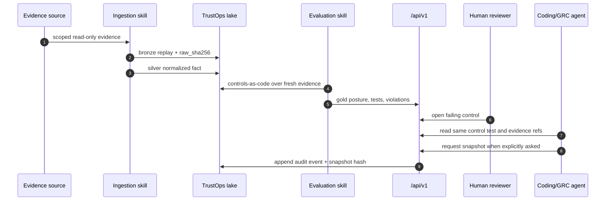

# Human And Agent API

The API is the shared control surface for the TrustOps console, coding agents,
CI jobs, MCP tools, and reviewer workflows. Route names describe assessment
concepts, not storage implementation details.

<p align="center">
  
</p>

Humans and agents use the same facts:

| Caller           | First action                                    | Allowed actions                                                       | Audit boundary                                             |
| ---------------- | ----------------------------------------------- | --------------------------------------------------------------------- | ---------------------------------------------------------- |
| Human console    | Load current posture and work queues            | Triage, request evidence, create snapshots, run guarded workflows     | Session or API key identity, tenant, role, route, decision |
| Coding/GRC agent | Read posture, then control tests and violations | Explain gaps, propose owner actions, create snapshots only when asked | API key identity, scoped role, correlation ID              |
| CI/release gate  | Read posture-as-of or current posture           | Fail or warn on policy threshold; optionally create release snapshot  | API key identity, route, decision, status                  |
| MCP client       | Call the same v1 resources as tools             | Read/write tools only where the role allows it                        | Same RBAC and audit event model                            |

Use `/api/v1/*` for external automation. Versioned responses always use:

```json
{
  "data": [],
  "meta": {
    "api_version": "v1",
    "resource": "control-tests",
    "count": 4,
    "returned": 4,
    "limit": 100,
    "offset": 0,
    "sort": null,
    "filters": {}
  },
  "errors": []
}
```

List routes support:

- `limit`: 1-1000, default 100
- `offset`: zero-based row offset
- `sort`: field name, or `-field` for descending
- field filters: exact scalar match, list membership match, comma-separated OR
  values

## End-To-End Flow



The important rule: the workbench is not a special surface. Every significant
human action should have the same JSON contract an agent can call, and every
agent action should be rendered back to humans with the same audit trail.

## Routes

| Method | Path                      | Purpose                                                                       |
| ------ | ------------------------- | ----------------------------------------------------------------------------- |
| `GET`  | `/api/v1/healthz`         | service health                                                                |
| `GET`  | `/api/v1/posture/current` | continuously evaluated posture                                                |
| `GET`  | `/api/v1/posture/as-of`   | posture at a point in time                                                    |
| `GET`  | `/api/v1/control-tests`   | control tests with owners, evidence requirements, confidence, and next action |
| `GET`  | `/api/v1/violations`      | open control and asset violations                                             |
| `GET`  | `/api/v1/controls`        | control workbench data                                                        |
| `GET`  | `/api/v1/evidence`        | normalized evidence facts, filterable by any top-level field                  |
| `GET`  | `/api/v1/assets`          | asset risk queue                                                              |
| `GET`  | `/api/v1/snapshots`       | list point-in-time assessment snapshots                                       |
| `POST` | `/api/v1/snapshots`       | create a point-in-time assessment snapshot                                    |

The unversioned `/api/*` routes remain for the bundled console and local
compatibility. Server mode serves the same unversioned surface behind the same
identity and RBAC boundary as `/api/v1/*`.

## Agent Usage Pattern

Agents should:

1. Read `/api/v1/posture/current` first.
2. Inspect `/api/v1/control-tests` for evidence requirements, confidence inputs,
   and next action.
3. Inspect `/api/v1/violations` for owner/action detail.
4. Query `/api/v1/controls` for framework context.
5. Create `/api/v1/snapshots` only when the user asks for an audit, vendor,
   board, incident, or release-gate snapshot.

Agents should not infer compliance status from visual text. The API is the
contract.

## Skills And Guardrails

TrustOps skills are small, auditable operating guides over this API and the lake
artifacts. A skill is not a hidden model prompt that invents controls. It is a
versioned contract that says what evidence it may read, what actions it may take,
what official sources it must cite, and what claims it must not make.

Recommended skill chain:

| Skill             | Reads                                           | Writes                                     | Guardrail                                                |
| ----------------- | ----------------------------------------------- | ------------------------------------------ | -------------------------------------------------------- |
| Ingestion skill   | source API or existing lake view                | raw connector evidence, bronze replay rows | read-only credentials; stable IDs; raw hash preserved    |
| Validation skill  | raw rows, connector run log                     | validation errors, normalized silver facts | fail closed on malformed records; no silent field drops  |
| Mapping skill     | silver facts, framework catalog                 | control/evidence links                     | source-linked mappings only; no invented controls        |
| Evaluation skill  | controls-as-code, freshness, evidence refs      | gold control tests, violations, confidence | deterministic rules; cite evidence refs and rule reasons |
| Remediation skill | violations, owners, SLA policy                  | task, evidence request, workflow run       | role-gated actions; no external calls unless allowlisted |
| Snapshot skill    | current posture and evidence refs               | immutable point-in-time snapshot           | user-requested reason; hash and audit event required     |
| Debug/log skill   | connector runs, validation errors, audit events | diagnostic summary                         | redacts secrets and role-restricted fields               |

At scale, these skills should run as scheduled jobs or workflow nodes, not as a
single autonomous blob. The control plane records who or what ran the skill,
which version was used, which inputs were read, which outputs changed, and which
audit event/correlation ID proves the action.

Skill manifests should include:

```yaml
name: evidence-ingestion
version: 0.1.0
role_required: security_admin
reads:
  - connector_config
  - source_api_or_lake_view
writes:
  - bronze/replay
  - connector_runs
tests:
  - fixture_replay
  - schema_validation
  - secret_redaction
  - idempotent_replay
```

## OCSF Boundary

TrustOps uses OCSF where OCSF is a good fit: cloud, identity, repository,
runtime, detection, vulnerability, and audit telemetry. It does not force OCSF
onto everything.

The canonical TrustOps model stays separate for:

- framework catalogs, source provenance, and control mappings
- evidence requirements and controls-as-code rules
- posture scores, confidence, freshness, exceptions, and owner SLAs
- remediation tasks, workflow runs, snapshots, trust shares, and audit boundary

That split is intentional. OCSF normalizes security facts; TrustOps models the
trust operation built on top of those facts. Connector and ingestion skills may
emit OCSF-shaped silver records when possible, plus TrustOps-specific fields
where needed for control evaluation and audit proof.

## Example

```bash
security-lakehouse serve --lake build/lakehouse --port 8787

curl -s http://127.0.0.1:8787/api/v1/posture/current | jq .
curl -s 'http://127.0.0.1:8787/api/v1/control-tests?result=fail&sort=-confidence_score&limit=10' | jq .
curl -s 'http://127.0.0.1:8787/api/v1/violations?severity=critical,high' | jq .
curl -s -X POST http://127.0.0.1:8787/api/v1/snapshots \
  -H 'content-type: application/json' \
  --data '{"reason":"vendor_due_diligence"}' | jq .
```
