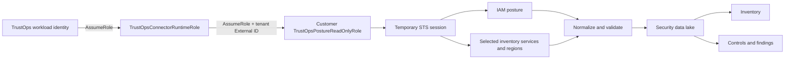

# AWS connector architecture

## Identity boundary

- `TRUSTOPS_AWS_LINK_PRINCIPAL` is the real `TrustOpsConnectorRuntimeRole` ARN shown in customer trust policies.
- Each linked customer role gets a server-generated External ID. TrustOps stores the role ARN and External ID, never customer access keys.
- Probe and sync each call STS and use that operation's temporary session for all AWS API clients.
- Local development must assume the runtime role through the normal AWS credential chain. Developer users and `abom-*` profiles are bootstrap details and are never emitted into customer scripts.

## Customer setup

1. TrustOps starts a tenant-scoped link session and generates an External ID.
2. The customer copies the self-contained command into AWS CloudShell. It embeds the reviewed CloudFormation template and does not contact localhost or TrustOps.
3. CloudFormation creates the customer-owned read-only role and prints its ARN.
4. The customer returns that ARN. TrustOps validates its shape, stages it, and verifies `sts:AssumeRole` plus the baseline IAM read.
5. Each sync assumes the role again, reads IAM posture and the selected regions/services, normalizes assets, evaluates mapped controls, and writes Inventory and Findings data.

## Deployment stack

- Frontend: React/Next.js connector wizard with separate Setup, Runs, and Events views.
- API: cloud-link session generation, role-ARN completion, probe, configuration, and sync endpoints.
- Identity middleware: ambient workload credentials → runtime role → customer role with External ID.
- Collectors: IAM, EC2, S3, RDS, CloudTrail, Config, Security Hub, and Organizations.
- Data path: raw evidence → schema validation → normalized events → current posture, asset inventory, and findings.

Deploy the service-side runtime role from `deploy/aws/trustops-connector-runtime-role.yaml`, then set its output ARN as `TRUSTOPS_AWS_LINK_PRINCIPAL`. Creating that role changes IAM and remains an explicit operator deployment step.
