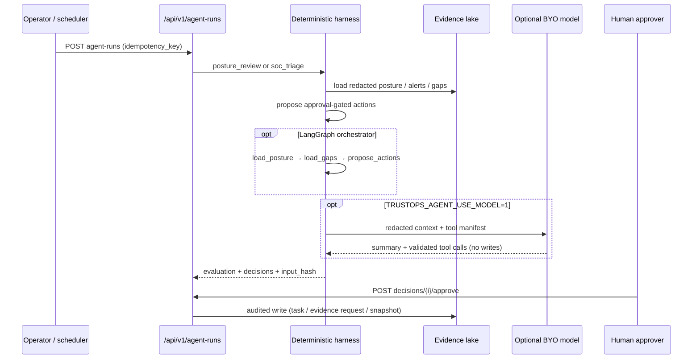

# Agent Workflow (persisted harness)



Agents answer from generated lake artifacts and persisted run records. Every claim
should cite posture, control tests, evidence refs, or a stored `input_hash`.

Legacy CLI-only flow (local demos):

```bash
security-lakehouse agents posture-review --lake build/lakehouse --orchestrator langgraph
security-lakehouse agents soc-triage --lake build/lakehouse --orchestrator langgraph
```

See [Agent Harness](AGENT_HARNESS.md) and [Shareable Demo](SHAREABLE_DEMO.md).
