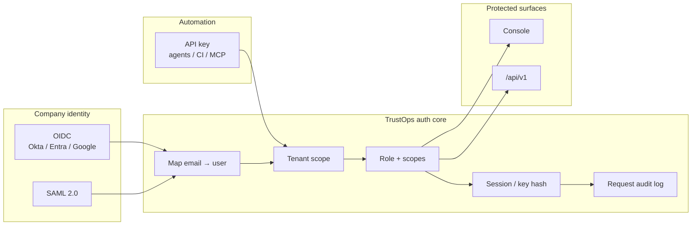
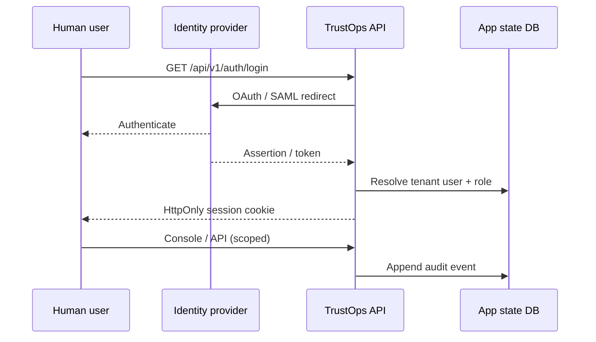

# Identity & Auth Boundary

TrustOps server mode uses one identity model for browser SSO and headless API
keys — the same tenant, role, scope, and audit envelope.

## Identity flow

## OIDC vs SAML vs API key

| Method | Best for | TrustOps endpoints |
| ------ | -------- | ------------------ |
| **OIDC** | Modern IdPs (Okta, Entra ID, Google) | `GET /api/v1/auth/login` → callback |
| **SAML 2.0** | Enterprise IdPs without OIDC | `GET /api/v1/auth/saml/login` → ACS |
| **API key** | Agents, CI, MCP clients | `POST /api/v1/auth/keys` (admin) |

## Session contract

## Roles (summary)

| Role | Typical access |
| ---- | -------------- |
| `admin` | Full platform + key admin |
| `security_admin` | Connectors, workflows, snapshots |
| `contributor` | Triage, evidence requests |
| `auditor` | Read-only + redaction |
| `read_only` | Internal read |

See [SERVER_AUTH.md](../SERVER_AUTH.md) and
[identity boundary SVG](../images/trustops-identity-boundary.svg).
