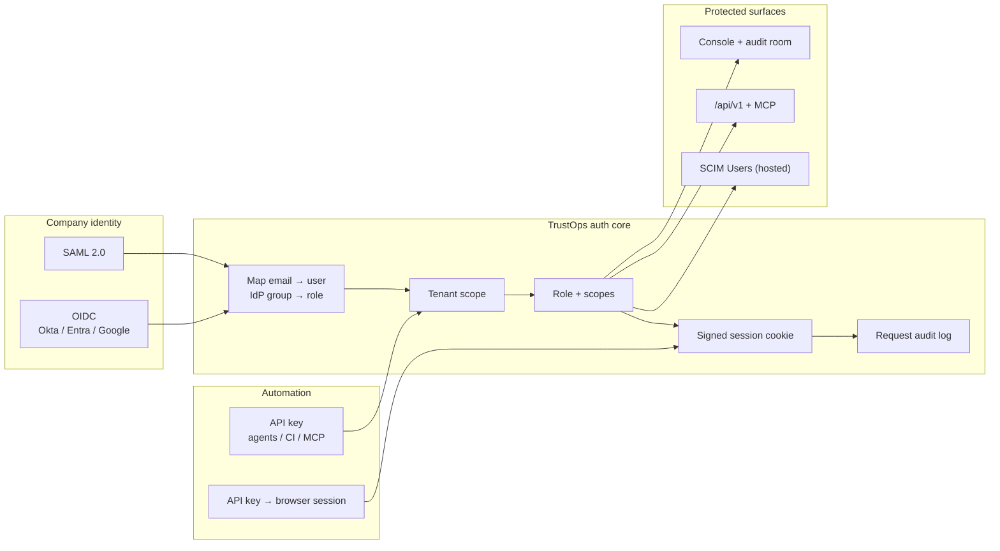
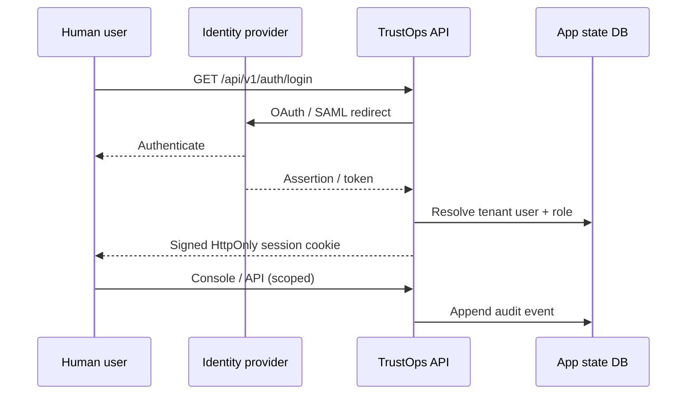

# Identity & Auth Boundary

TrustOps server mode uses one identity model for browser SSO and headless API
keys — the same tenant, role, scope, and audit envelope.

## Identity flow

## OIDC vs SAML vs API key

| Method            | Best for                             | TrustOps endpoints                   |
| ----------------- | ------------------------------------ | ------------------------------------ |
| **OIDC**          | Modern IdPs (Okta, Entra ID, Google) | `GET /api/v1/auth/login` → callback  |
| **SAML 2.0**      | Enterprise IdPs without OIDC         | `GET /api/v1/auth/saml/login` → ACS  |
| **API key**       | Agents, CI, MCP clients              | `Authorization: Bearer tops_…`       |
| **Key → session** | Console without SSO                  | `POST /api/v1/auth/session-from-key` |
| **SCIM**          | Hosted enterprise provisioning       | `/api/v1/scim/v2/Users` (commercial) |

## Session contract

Browser session cookies are **always signed** when auth is enabled
(`TRUSTOPS_COOKIE_SIGNING_KEY`). OIDC OAuth state uses a separate
`TRUSTOPS_SESSION_SECRET`.

## Admin surfaces

| Surface                              | Purpose                                             |
| ------------------------------------ | --------------------------------------------------- |
| `GET/PATCH /api/v1/auth/users`       | Tenant user directory (admin)                       |
| `POST /api/v1/auth/session-from-key` | Paste API key on login page                         |
| Console **Access**                   | API keys, users & roles, invites                    |
| IdP role maps                        | `TRUSTOPS_OIDC_ROLE_MAP` / `TRUSTOPS_SAML_ROLE_MAP` |

## Roles (summary)

| Role             | Typical access                   |
| ---------------- | -------------------------------- |
| `admin`          | Full platform + key admin        |
| `security_admin` | Connectors, workflows, snapshots |
| `contributor`    | Triage, evidence requests        |
| `auditor`        | Read-only + redaction            |
| `read_only`      | Internal read                    |

See [SERVER_AUTH.md](../SERVER_AUTH.md) and
[identity boundary SVG](../images/trustops-identity-boundary.svg).
