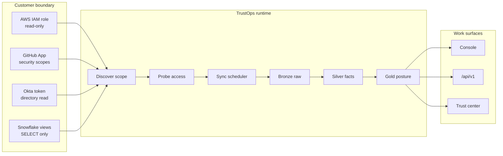
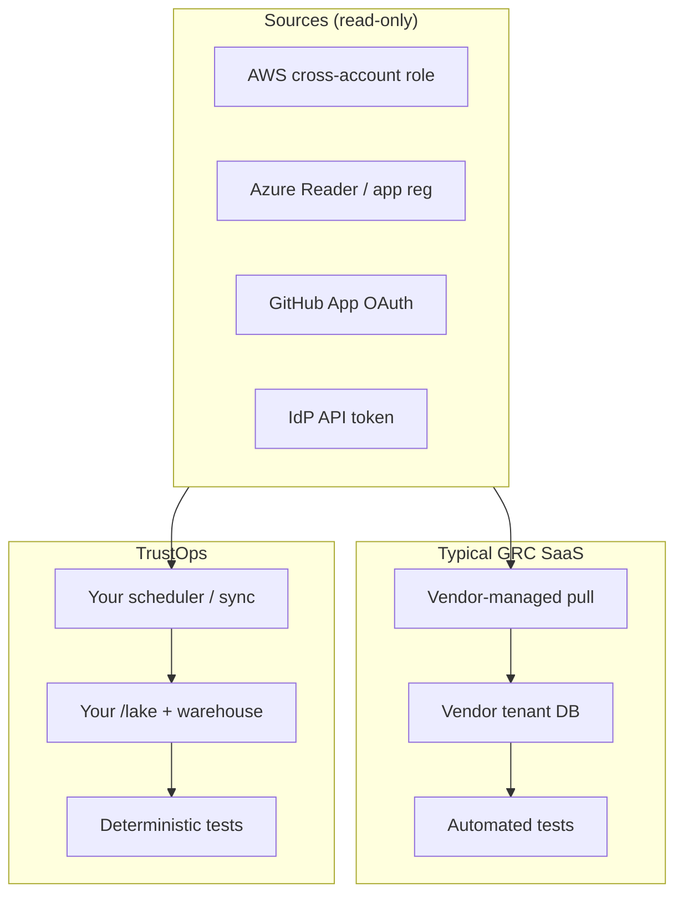
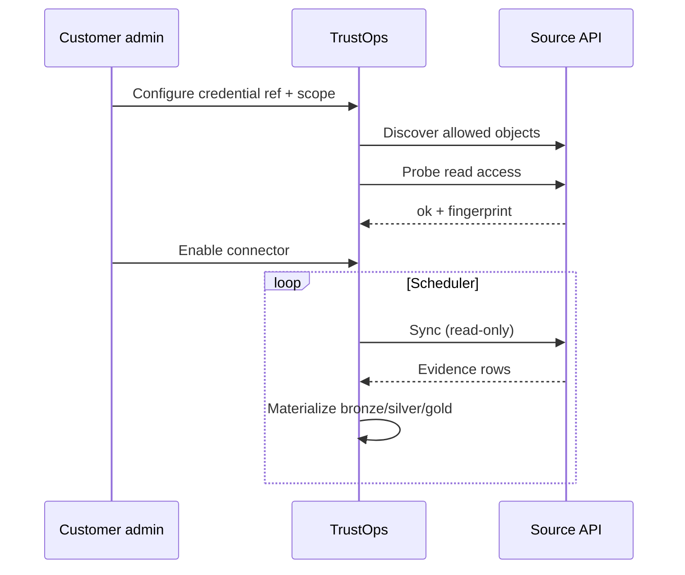

# Connector Ingestion — Read-Only Connection Model

How TrustOps (and typical Drata/Vanta-style GRC tools) connect to sources:
**APIs and read-only roles**, not admin write access.

## TrustOps ingestion loop

## Drata / Vanta vs TrustOps (same connect, different storage)

## Connection matrix

| Source | Connection mechanism | Permissions style |
| ------ | -------------------- | ----------------- |
| AWS | Cross-account **IAM role** + External ID (or SSO profile) | `List*`, `Get*`, `Describe*` — no write |
| Azure | App registration / **Reader** / workload identity | Subscription & IAM read |
| GCP | Service account / WIF | Asset & IAM inventory read |
| GitHub | **GitHub App** installation token | Security alert read scopes |
| Okta | **API token** or OAuth | `okta.users.read`, policies read |
| Google Workspace | OAuth bearer + customer ID | Directory read-only scopes |
| Snowflake | Key-pair service user | `SELECT` on granted views only |

## Lifecycle (probe-gated)

See also:

- [CONTINUOUS_INGESTION.md](../CONTINUOUS_INGESTION.md)
- [CONNECTORS.md](../CONNECTORS.md)
- [Read-only connections SVG](../images/trustops-readonly-connections.svg)
