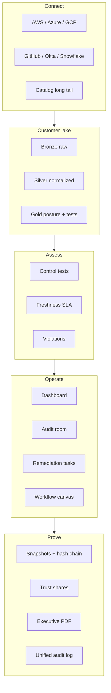

# Core GRC Loop

How TrustOps moves from connector sync to auditor-ready proof — the same path
in the console, `/api/v1`, and MCP.

See also: [PRODUCT_SHAPE.md](../PRODUCT_SHAPE.md) · [AUDIT_READINESS.md](../AUDIT_READINESS.md)

## Loop

## Stage map

| Stage | Console | API / headless |
| ----- | ------- | -------------- |
| Connect | `/console/connectors/` | `POST /api/v1/connectors/{id}/sync` |
| Evaluate | `/console/controls/` | `GET /api/v1/posture/current` |
| Freshness | `/console/audit-room/` | `GET /api/v1/evidence/freshness/summary` |
| Remediate | `/console/remediation/` | `POST /api/v1/evidence/freshness/escalate` |
| Review | `/console/access-reviews/` | `GET /api/v1/platform/audit-readiness` |
| Share | `/console/trust-center/` | Trust token routes + snapshot export |

## Identity spine

Every secured route resolves **API key, OIDC, or SAML** → user → tenant → role →
scopes → request audit event. Browser sessions use **signed cookies**
(`TRUSTOPS_COOKIE_SIGNING_KEY`). See [auth-identity.md](auth-identity.md).
