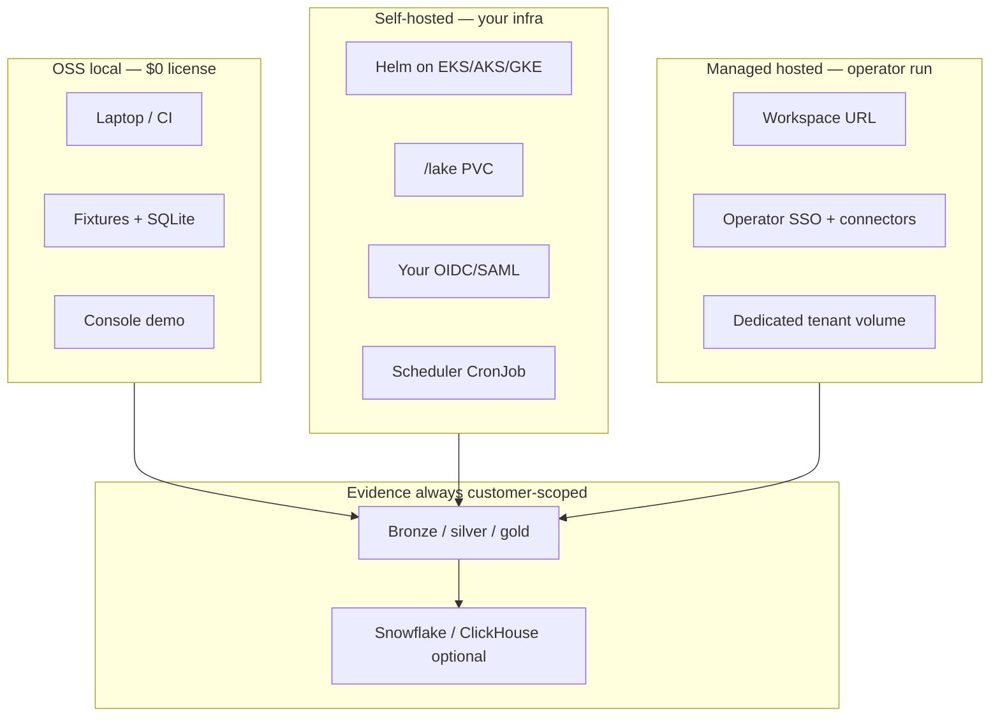
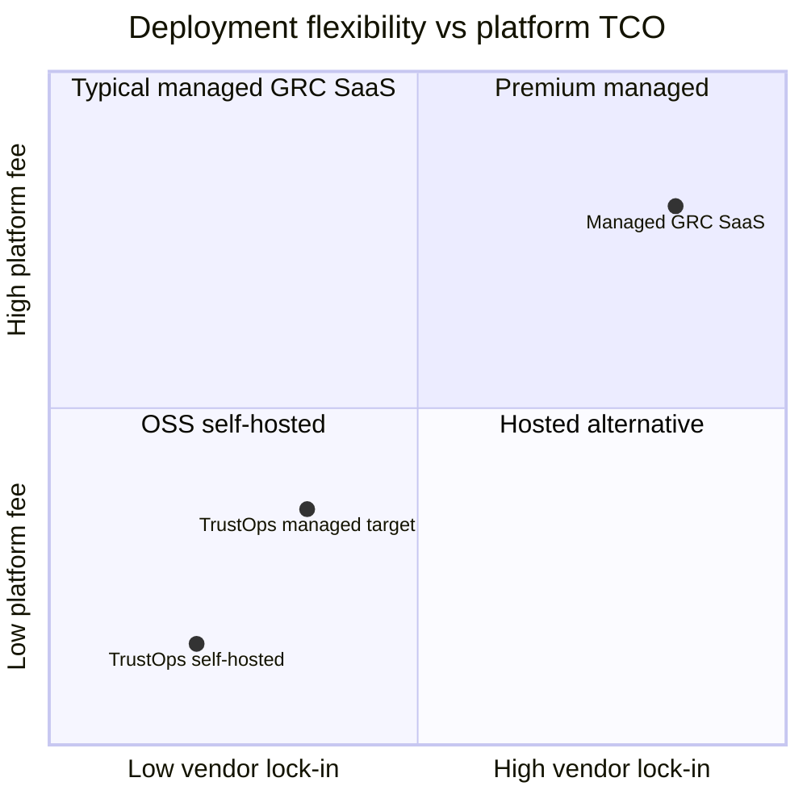

# Deployment Models

OSS local, self-hosted, and managed hosted — same product, different ops boundary.

## Cost boundary vs GRC SaaS

See [DEPLOYMENT_AND_PRICING.md](../DEPLOYMENT_AND_PRICING.md).
