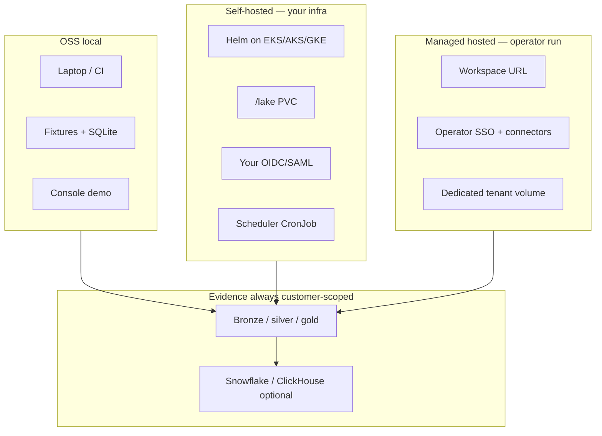

# Deployment Models

OSS local, self-hosted, and managed hosted — same product, different ops boundary.

```mermaid
flowchart TB
  subgraph OSS["OSS local"]
    LAP["Laptop / CI"]
    FIX["Fixtures + SQLite"]
    DEMO["Console demo"]
  end

  subgraph SH["Self-hosted — your infra"]
    HELM["Helm on EKS/AKS/GKE"]
    PVC["/lake PVC"]
    SSO["Your OIDC/SAML"]
    SCHED["Scheduler CronJob"]
  end

  subgraph MH["Managed hosted — operator run"]
    URL["Workspace URL"]
    OP["Operator SSO + connectors"]
    TEN["Dedicated tenant volume"]
  end

  subgraph Evidence["Evidence always customer-scoped"]
    LAKE["Bronze / silver / gold"]
    WH["Snowflake / ClickHouse optional"]
  end

  OSS --> LAKE
  SH --> LAKE
  MH --> LAKE
  LAKE --> WH
```

See [DEPLOYMENT.md](../DEPLOYMENT.md).
