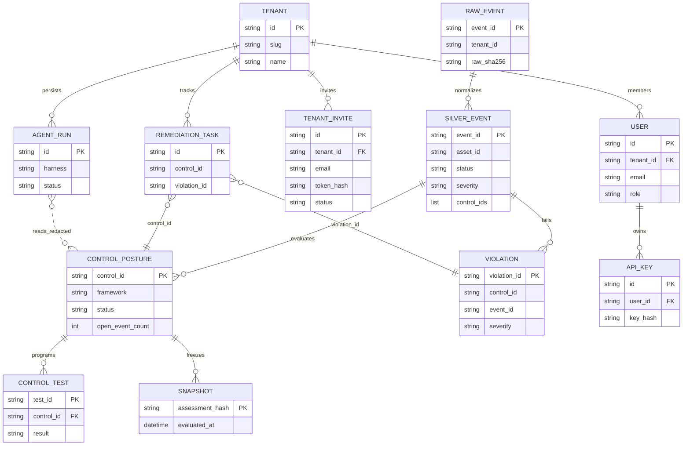

# Unified Data Model

Single-page view of **lake zones** (compliance truth), **application state** (server DB), and how API surfaces read them.



## Zone summary

| Zone | Storage | Writer | Primary consumers |
| ---- | ------- | ------ | ----------------- |
| **Raw / bronze** | `raw/`, `bronze/*.jsonl` | Connector sync (single writer) | Pipeline replay |
| **Silver** | `silver/normalized_events.jsonl` | Pipeline | Assessment, SOC harness |
| **Gold** | `gold/*.jsonl`, `current_posture.json` | Pipeline + assessment | Console, `/api/v1`, PDF export |
| **Snapshots** | `gold/snapshots/`, ledger | Assessment API | Audit, trust center point-in-time |
| **App DB** | `server/app.db` or Postgres | Server mode API | Auth, remediation, agents, invites |
| **Marts** | `mart/*.sqlite`, `*.duckdb` | Pipeline | Analytics CLI, optional BI |

## Read paths

```text
Console / API / MCP
  ├─ posture, controls, violations  → gold/ + silver/ (lake)
  ├─ auth, keys, sessions             → app DB
  ├─ remediation, evidence requests   → app DB (+ lake control_id refs)
  └─ agent runs                       → app DB (sanitized state, no raw lake path)
```

## Related docs

- [DATA_MODEL.md](../DATA_MODEL.md) — logical assessment entities
- [diagrams/data-model.md](data-model.md) — analytics mart tables
- [ARCHITECTURE.md](../ARCHITECTURE.md) — pipeline flow
- [DATA_FLOW.md](../DATA_FLOW.md) — ingestion → evaluation
