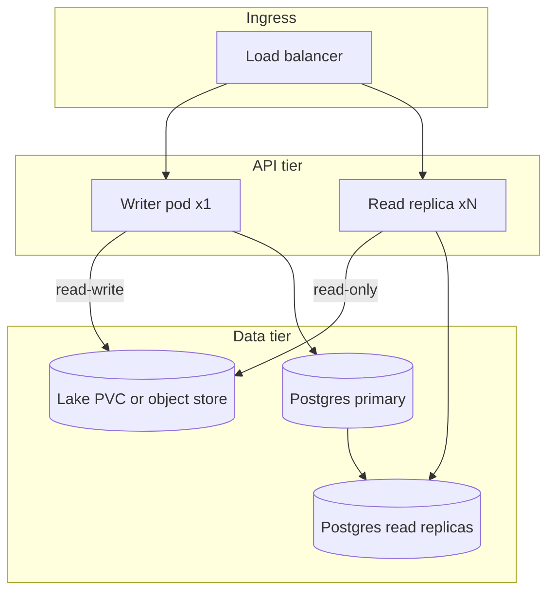

# High Availability: Read Replicas And Single Writer

TrustOps separates **compliance truth** (the evidence lake) from **application state**
(Postgres/SQLite under `server/app.db`). HA patterns differ for each layer.

## Single-writer rule (lake)

The Python pipeline and connector sync assume **one writer** for `/lake`:

```text
connector sync  →  raw/bronze/silver/gold JSONL  →  single-writer materialize
scheduler tick  →  workflow runs, connector state
```

| Deployment | `replicaCount` | Lake mount | Safe? |
| ---------- | -------------: | ---------- | ----- |
| Default self-hosted | 1 | RWO PVC read-write | Yes |
| Auditor portal | 2+ | RWO **read-only** on replicas | Yes (read APIs only) |
| Multi-writer API | 2+ | RWO read-write | **No** — corrupts JSONL |

Helm blocks `replicaCount > 1` with a ReadWriteOnce lake unless `lake.readOnly: true`.

## Recommended HA topology



### Writer pod (required)

- `replicaCount: 1` for the **writer** release, or a dedicated Helm release named `trustops-writer`
- Runs connector sync, scheduler CronJob target lake, workflow mutations, agent approvals
- Mounts lake **read-write** (RWO PVC, NFS RWX, or S3-backed sync sidecar — future)

### Read replicas (optional)

- Separate release with `lake.readOnly: true`, `replicaCount: 2+`
- Serves `/api/v1/posture/*`, evidence lists, trust-center reads
- **No** connector sync, **no** scheduler, **no** workflow writes on read pods
- Set `scheduler.enabled: false` on read-only releases

## Application database (Postgres)

SQLite (`server/app.db` on the lake PVC) is single-file and not HA. For production:

| Mode | Guidance |
| ---- | -------- |
| **SQLite** | Single pod only; backup via [BACKUP_RESTORE.md](BACKUP_RESTORE.md) |
| **Postgres primary** | Set `TRUSTOPS_DATABASE_URL`; one writer pod runs migrations |
| **Read replicas** | Point read-only API pods at `TRUSTOPS_DATABASE_READ_URL` (future); writer uses primary URL |

Today the server uses one SQLAlchemy URL. Split read/write URLs are on the roadmap; until then run **one writer API** against Postgres primary.

## Shared state caveats

| Mechanism | Single-node today | Multi-replica note |
| --------- | ----------------- | ------------------ |
| Rate limiting | In-process | Per-pod buckets; use ingress rate limits or Redis (future) |
| Session cookies | Postgres/SQLite | Sticky sessions or shared session store |
| Scheduler | CronJob → lake | Must not run on read-only replicas |
| Idempotency keys | DB | Safe across replicas when all use same Postgres |

## Example: auditor read pool

```yaml
# trustops-read.yaml
replicaCount: 3
lake:
  readOnly: true
  persistence:
    enabled: true
    accessMode: ReadOnlyMany # requires CSI/driver support
scheduler:
  enabled: false
security:
  requireAuthentication: true
env:
  - name: TRUSTOPS_OIDC_CLIENT_ID
    valueFrom: { secretKeyRef: { name: trustops-oidc, key: client_id } }
  - name: TRUSTOPS_SESSION_SECRET
    valueFrom: { secretKeyRef: { name: trustops-session, key: secret } }
  - name: TRUSTOPS_PUBLIC_URL
    value: https://trustops.example.com
```

Writer release keeps `replicaCount: 1`, `lake.readOnly: false`, `scheduler.enabled: true`.

## Health and failover

- **Liveness**: `/api/healthz` (no auth)
- **Readiness**: same; read replicas may serve traffic while writer resyncs connectors
- **Failover**: promote read replica only for **read** traffic; never split lake writers without external orchestration

## Related docs

- [BACKUP_RESTORE.md](BACKUP_RESTORE.md)
- [OBSERVABILITY_CONNECTOR_SYNC.md](OBSERVABILITY_CONNECTOR_SYNC.md)
- [deploy/README.md](../../deploy/README.md)
- [SERVER_AUTH.md](../SERVER_AUTH.md)
