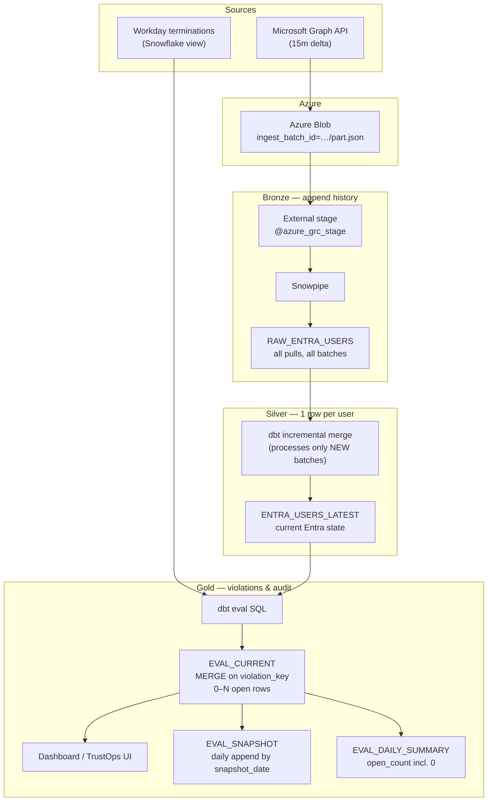

# Architecture — post-termination access SLA

## End-to-end diagram (interview slide)



## Why bronze → silver → gold (not bronze → gold)

Skipping silver and evaluating straight from RAW forces every eval to scan **full history**:

```sql
-- Without silver: expensive every run
SELECT * FROM raw
QUALIFY ROW_NUMBER() OVER (PARTITION BY user_id ORDER BY ingest_time DESC) = 1
```

Silver (`ENTRA_USERS_LATEST`) materializes that once per ingest batch. Gold eval joins:

- `WORKDAY_TERMINATIONS_LATEST` (or view)
- `ENTRA_USERS_LATEST`
- `AWS_IAM_USERS_LATEST` (same pattern)

→ small join → `EVAL_CURRENT` for UI.

## RAW append vs LATEST merge — side by side

After three hourly pulls for user `alice`:

**RAW (bronze)** — 3 rows, same `user_id`:

| user_id | account_enabled | ingest_batch_id | ingest_time |
|---------|-----------------|-----------------|-------------|
| alice | true | batch_10 | 10:00 |
| alice | true | batch_11 | 11:00 |
| alice | false | batch_12 | 12:00 |

**LATEST (silver)** — 1 row:

| user_id | account_enabled | ingest_batch_id | ingest_time |
|---------|-----------------|-----------------|-------------|
| alice | false | batch_12 | 12:00 |

dbt incremental merge run at 12:00 only **read** `batch_12` rows, then upserted LATEST.

## Violation lifecycle

| Day | Eval result | EVAL_CURRENT | EVAL_SNAPSHOT |
|-----|-------------|--------------|---------------|
| Mon | 10 terminated + active | 10 `open` | 10 rows `snapshot_date=Mon` |
| Tue | same 10 | 10 `open`, `last_seen_at` updated | 10 rows `snapshot_date=Tue` |
| Wed | 2 revoked | 8 `open`, 2 `resolved` | 8 rows |
| Thu | all revoked | 0 `open` | 0 rows + summary `open_count=0` |

## Idempotency keys

| Layer | Key |
|-------|-----|
| Blob path | `entra/ingest_batch_id={iso}/part-000.json` |
| RAW row | `(user_id, ingest_batch_id)` |
| LATEST | `user_id` |
| Violation | `violation_key = hash(employee_id, platform, principal_id)` |
| Graph watermark | `delta_link` in `INGEST_WATERMARKS` |

## Empty delta = no file

If Graph delta returns zero changes and zero removals, the ingest script **does not write a blob file**.
Snowpipe has nothing to load; dbt silver skips; eval can still run on existing LATEST.
